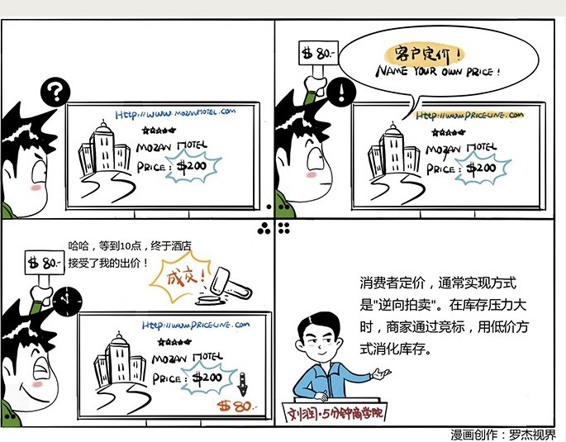

# 045｜定价权，能交给消费者吗？

### 概念：消费者定价

> 价钱必须由商家来定吗？消费者就没有权利定价吗？当然有，而且，消费者定价，是自古就有的一种定价策略，叫做：拍卖。

拍卖，是一种特殊的定价策略。这种策略中，蕴含着信息经济学、激励理论、博弈论等等重要学问。

### 延伸1：荷兰式拍卖

在供小于求，也就是一物难求造成的卖方市场下，拍卖，可以帮助商家尽量缩小“消费者剩余”。

比如，你想出售一只迈克尔·乔丹的签名篮球，非常稀缺，所以想卖得越贵越好，也就是尽量缩小“消费者剩余”，怎么做呢？

你可以试试：荷兰式拍卖。

荷兰式拍卖，就是先从一个最高价开始，不断往下喊价，只要有人接受，就成交。这种拍卖法的好处是，价格从高往低，一旦落入消费者心理价位区间内的最上限，他就会购买，因为万一此时保守，侥幸等待更低价，商品就可能被别人买走。

### 延伸2：维克瑞拍卖

著名经济学家威廉·维克瑞因为研究拍卖，在1996年获得了诺贝尔经济学奖。他还专门提出过一个著名的“维克瑞拍卖”法。

比如你想把自己的房子卖了，7、8个人都想买。你怎么才能把房子卖出最高价呢？也许你觉得价高者得就好了吗，但问题是，大家都会很保守，故意不喊高价。这时候，你试一试，用“维克瑞拍卖” 法。还是拍卖，最高出价者得房，但是，以次高价格付款。维克瑞说，在这种拍卖制度下，报低价不但不能赢得拍卖，还将让出高价者用你出的低价获得商品，所以，买房者会有更大的动机，报出高价，抢购你的房子。

### 升级：逆向拍卖

在美国有个公司，叫Priceline。我今天飞到西雅图，约微软老友一起吃饭。西雅图的五星级酒店假设200美元一晚，我拿出手机用Priceline出价80美元要住，估计没人搭理我。没关系，我边吃边等，九点钟可能就有酒店搭理我了吗？还没有？继续等。酒店的房间，就是库存。这种库存和衣服不同，一旦过了半夜，就彻底清零了。所以，十点，它基本确定今晚有库存风险后，就可能接下我80美元住一晚的订单，至少比空在那里好。它决定晚上十点接单，旁边的酒店就想，我提前半小时行不行？他为了生意，可能九点半就接了。而另一家呢，可能九点钟就接了。

你发现没有，我在西雅图一晚花多少钱住酒店，是我定的。Priceline把这种特殊的定价策略，起了个名字，叫“Name your own price”（客户定价），并在1998年就申请了专利，限制其他企业20年内不得使用相同模式。Priceline也因此成为了美国最大的在线旅游公司。

这个看上去很神奇的Priceline模式，还可以用在别的地方吗？

有一家叫ScoreBig的公司，就是帮助消费者用最低价格买到各种活动、比如演唱会的门票。据说，他们帮消费者平均节省40%的费用，但同时让活动上座率和收入都获得最大化收益。

还有一家叫做Greentoe的公司，就是帮助消费者用最便宜的价格买到商品。比如佳能的相机均价550-600美元之间。你试试报价450美元看，还真的会有商家卖给你。

Pirceline，ScoreBig，Greentoe这些公司的“消费者定价”的逻辑能够成立，都有一个大前提：商家有巨大的库存压力。尤其是酒店房间、机票、演唱会门票，一旦过了时间，库存彻底报废。这种“逆向拍卖”的本质，都是用一种特殊算法，把商品的库存压力，和消费者占便宜心理，用不影响正常售价的方式，巧妙地结合了起来。

### 小结：认识消费者定价

消费者定价通常实现的方式是“拍卖”和“逆向拍卖”。拍卖，就是在供小于求，一物难求，卖方主动的情况下，通过消费者竞标的方式，获得最高成交价的一种“消费者定价”策略，比如荷兰式拍卖、维克瑞拍卖等等。逆向拍卖，就是在供大于求、库存压力大、买方主动的情况下，通过商家竞标的方式，尽量用低价满足价格敏感者，实现消化库存的目的。典型的案例有Priceline、ScoreBig、Greentoe等等。

在有些城市，也有些商家，比如餐厅、小超市等，在进行一种“你随便吃，随便拿，最后请看着给钱”的商业试验。这些实验，据说有些获得了成功，有些最后关门歇业。本质上来说，“看着给钱”不是一种“消费者定价”的商业模式，更多是一种道德测验。