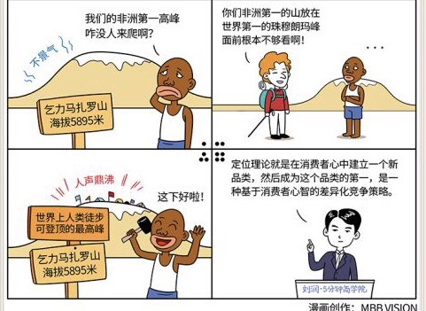

# 046｜占领市场之前，占领心智

本周，我们开始讲营销。如果说商业是一场战争，渠道就是地面部队，它的最高任务是堵门，用最优性价比，在一场又一场巷战中，抢占所有与消费者之间的触点。而营销，就是空中部队，它的最高任务是洗脑，利用“国军节节败退，我军又下一城”的炮弹，全面攻占消费者大脑，写入“只能买我”四个字。

谈到营销，我们必须从全球最著名的营销策略“定位”开始。

### 概念：定位理论

> 定位理论就是，不能成为品类第一，就创造一个新品类。特劳特在1972年提出了这个理念，并称之为“定位”，Positioning。2001年，特劳特的定位理论，力压著名营销大师菲利普·科特勒，和著名战略大师迈克尔·波特，被美国营销协会评为“有史以来对美国营销影响最大的观念”。

### 定位理论有效的基础，是消费者的5大心智模式：

第一，消费者只能接收有限的信息；

第二，消费者喜欢简单，讨厌复杂；

第三，消费者缺乏安全感；

第四，消费者对品牌的印象不会轻易改变；

第五，消费者的心智容易失去焦点

### 案例

全球最高的山峰是哪一座？大部分人都知道，珠穆朗玛峰。第二高呢？估计很多人就不知道了，是乔戈里峰。第三高呢？估计你听都没听过：干城章嘉峰。

大多数人只能记住第一名，最多第二名。这种情况，是人类的心智模式决定的。不仅生活，商业也一样。英文中，我们把在市场中占据的份额叫做Market Share，把在大脑中占据的份额，叫做Mind Share。显然，占据第一大脑份额的，也就是成为你心中的“品类第一”，必然会获得巨额收益。

2015年，作者和我的十几位朋友一起去攀登了非洲第一高峰，乞力马扎罗，海拔5895米。乞力马扎罗虽然是非洲第一高峰，但是它的海拔，放在珠峰面前，简直就是找虐。那怎么办呢？聪明的非洲人在登山界开创了一个品类，叫做“人类徒步可登顶的高山”，说起乞力马扎罗，是地球上人类可徒步登顶的最高峰。这什么意思？其他山再高，都要借助缆绳、悬梯、冰镐才能登顶。靠双脚就能走上去的，我是全球最高。不服来战。这就一下子给乞力马扎罗造成了极大的话题性，来徒步挑战者如云。

### 运用：利用定位理论的四个建议

第一，从消费者心智出发，不要从产品出发。

比如你是做化妆品的，还有什么用户需求，是你的竞争对手未能满足的？比如补水？让你的肌肤一天喝八杯水？比如你是做餐饮的，消费者怕油怕盐？那么蒸的，才是健康的？关注消费者的买点，而不是产品的卖点。

第二，基于这个没有被满足的需求，或者说痛点，创立一个干净的品类。

比如，降火凉茶。把这个品类先打扫干净，然后开始与自己作战，不断树立自己可以代表这个品类的消费者认知。

第三，占领消费者认知的武器，也就是信息，要极度简单。

记得吗？消费者只能接受有限信息，消费者喜欢简单，讨厌复杂。比如，“怕上火，就喝王老吉”。“今年过节不收礼，收礼只收脑白金”，“恒源祥，羊羊羊”。重复10000遍，别总是觉得自己这也好，那也好。优点太多，消费者记不住。

第四，要欢迎竞争。

虽然是你创立了这个品类，但是消费者心中其实留了两把椅子。比如团购品类，大众点评和美团；电商品类，天猫和京东；旅行网站，携程和去哪儿；更不要说可口可乐和百事可乐，宝洁和联合利华，奔驰和宝马。有个对手，品类才成立，而且会共同教育市场，做大蛋糕。

### 小结：认识定位理论

定位理论，就是在消费者心中建立一个新品类，然后成为这个品类的第一。

具体四个步骤。第一，找到未被满足的痛点；第二，据此建立新品类；第三，用最简单的信息不断攻占消费者心智；第四，和第二名一起夯实品类，做大蛋糕。

> 说到底，定位，是一种基于消费者心智的差异化竞争策略。