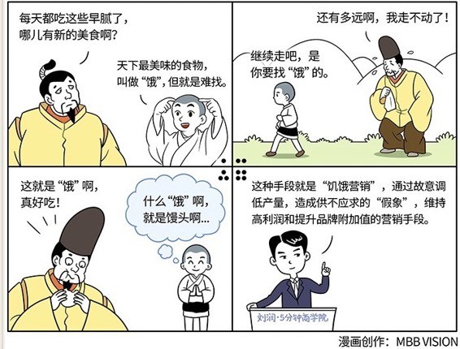

# 047｜金杯银杯，不如排队的口碑

#### 概念：饥饿营销

> 饥饿营销就是，通过故意调低产量，造成供不应求的“假象”，维持高利润和提升品牌附加值的营销手段。

它的本质，是“边际效用”理论在营销领域的应用。看上去饥饿营销的目的，是通过严格控制产量，让供给端始终远小于需求端，产生供不应求的假象，把消费者“饿”晕，然后抬高价格，获得暴利。但实际上，因为饥饿本身也限制了销量，所以利润未必大。

> 所以，饥饿营销真正目的，不是为了利润，而是为了品牌附加值。

### 案例1

去年有一家品牌商想请作者吃饭，作者特别忙，本来都要礼貌地拒绝了，但是瞟了一眼餐厅的名字，立刻从座位上跳起来，爽快地答应了。这家餐厅，是我定了几个月都没订到的一家餐厅，它被很多美食杂志评为全球最佳的几十家餐厅之一。如此盛名，但是至今，它每晚只接待一桌共10位客人，所以你可以想象，大上海2000多万人，多少人在翘首排队。别人排队，是排几个小时，可他们排队，据说至少要排到几个月。因此，用餐的价格，也到了六、七千元每一位的天价。

你可能会问，至于吗？真的有那么好吃吗？我一个月山珍海味，也未必吃得了六七千啊。还有，这个老板傻吧，既然这么火，赶快换张大桌子，多加几双筷子，或者搞个千人大厅，再开几个V666，V888包房，然后全国开连锁啊。你再贵，一天就10个人，也赚不了什么钱啊。

这家餐厅的老板真的是个傻厨子吗？其实不是。他懂得一个，你都未必真懂的营销策略：饥饿营销。

### 案例2

我小时候看过一个动画片，叫《聪明的一休》，讲日本的皇帝，吃遍人间美味，越来越厌倦，每天都很郁闷，四处寻找新的美味。有一天，小和尚一休说，天下最美味的食物，叫做“饿”，人间绝品，但就是难找。皇帝很想试试。一休开始陪皇帝跋山涉水，月黑风高，来到荒郊野岭，把一个馒头递给他，说这就是“饿”，吃吧。皇帝狼吞虎咽，并将其封为天下第一美食。

> 所以，人们吃掉的不是食物，吃掉的，是“饿”这种感觉。

在商业世界也一样。让消费者“饿”，就成了一种重要的营销战术。这种战术，常被称为“饥饿营销”。

### 运用：如何来运用饥饿营销呢？

运用1：王阿婆的500个茶叶蛋

> 有个卖茶叶蛋的王阿婆，每天只做500个茶叶蛋，下午4∶30开卖，基本6∶30就被排成长龙的顾客队伍抢光。有人问她，为什么不多做几个？她说：那得花老大劲儿啊，我们现在一天忙几个钟头，回家轻轻松松打打小麻将，老两口带着女儿女婿，过得不要太滋润，何苦那么作践自己。她说的如此有道理，让你感叹这才是人生境界。今天学习了“饥饿营销”，你也许就会明白，不管王阿婆是有意，还是无意，她正在使用“饥饿营销”的策略。也许，这才是没有读过商学院的民间高手。

运用2：爱马仕经典包款Birkin 和Kelly

> 读过商学院的商业高手，打法就更高大上了。比如爱马仕，他们把“饥饿营销”做到了极致。爱马仕有一个经典包款Birkin 和Kelly，定价7万到30万元，但长年处于缺货状态，很多人在排队。长长的排队名单，更刺激了人们的渴望，据说排队三五年都很常见。你问他为什么，他一定苦着脸告诉你，这包太难做了，很难量产。很难量产，是很多机构给“饥饿营销”起的别名。

### 小结：使用饥饿营销的前提和副作用

使用饥饿营销有三个前提，产品具备不可替代性、消费者心智不成熟、市场竞争不激烈。

饥饿营销也有不少的副作用，值得注意。第一，客户流失。过度饥饿营销，就是将客户“送”给竞争对手。

第二，顾客反感。过度饥饿营销，会让消费者饿到冷静，觉得被愚弄，对品牌产生厌恶。