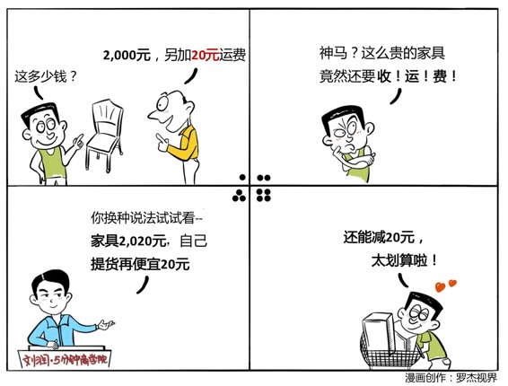

# 004｜得到100元，可以弥补失去100元吗？

概念：损失规避

得到的快乐其实并没有办法缓解失去的痛苦，心理学家把这种对损失更加敏感的底层心理状态叫做损失规避。甚至有科学家研究出来，这种损失所带来的负效用是同样收益所带来的正效用的2.5倍。

案例：

老人家想赶走来公共草地上玩耍的小孩子们，于是先后给出10块钱、5块钱、1块钱。最后小孩子们虽然能得到1块钱，但被拿走9块钱的痛苦要远远大于拿到10块钱的快乐，于是小孩子们再也不来草地上玩耍了。

运用：场景

场景1：

家具商场要收取20元的配送费，直接收取会触发消费者对于损失的厌恶心理，可以换种做法，将20元的配送费增加到产品的价格中，如果不需要配送，还可以便宜20元。

场景2：

消费者买家具时，会担心坏了怎么办。可以换种做法，提供7天无理由退换，消费者购买回家后，如果不是因为商品质量有问题，来退货的人是寥寥无几的。

场景3：

消费者很喜欢你们的沙发，想要买，但是家里已经有了一个，丢掉太浪费了。你可以提出以旧换新的服务，旧沙发抵值800元，这比你直接在沙发上打800块钱的折扣，对消费者来说更有诱惑。

小结：优化策略

第一，用换购（以旧换新）的方法来替代打折的方式。

第二，用获得的表述框架来替代损失的表述框架。

第三，条件成熟的时候，你说不定可以试着大胆推出无理由退货服务。

这是你在此学习的第三天，期待你的进步。

* * *

因为你刚我遇见我，留下足迹多美丽。