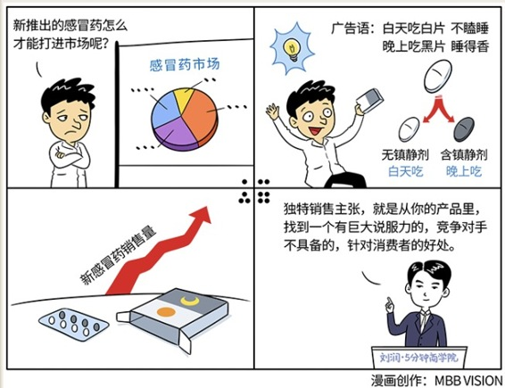

# 050｜只溶在口，不溶在手

> 产品已经有了，而且至少短时间没法改了，我有什么办法，把它卖得更好呢？

我要给你介绍一下“定位”的亲兄弟：USP，独特销售主张。定位从用户出发，独特销售主张从产品出发。

### 概念：USP-独特销售主张

> 独特销售主张，就是从你的产品里，找到一个有巨大说服力的、竞争对手不具备的、对消费者的好处。

独特的销售主张，是20世纪50年代，美国Ted Bates广告公司董事长罗瑟·瑞夫斯提出来的。

在瑞夫斯看来，一个“独特销售主张”必须具备三个突出特征：

第一，不应该是“买我们的吧”，不应该是自吹自擂，我们最好，竞争对手最差。你必须向消费者提出一种主张，让他们能够意识到产品给他们带来的真正好处。

第二，必须是竞争对手还没有提出来的，或者甚至无法提出来的。也就是说，它必须独特。

第三，必须有巨大的说服力，能够让消费者立刻采取行动，成为你的客户。

### 案例

> 1995年，感冒药的竞争激烈，康泰克、丽珠、三九等雄踞市场。这时，有一家叫盖天力的实力并不雄厚的药厂，也做了一款感冒药。但它想在感冒药这个用户的“心智阶梯”里，爬到第一、第二，比登天还难。

> 盖天力苦苦寻找，终于找到了一个独特的销售主张：白加黑。这个理念其实很简单，它把感冒药分为白片和黑片，并把有可能导致人昏昏欲睡的镇静剂“扑尔敏”只加在黑片中。其他，什么也没做。

> 但是，这个看似很简单的动作，却给盖天力找到了一个非常独特的销售主张：白天服白片，不瞌睡；晚上服黑片，睡得香。他们把这个销售主张，提炼成一句精炼的广告语：治疗感冒，黑白分明。

这一下子，整个感冒药市场被震撼了。“白加黑”上市半年，就突破了1.6亿元的销售额，强行占领了15%的市场份额，获得行业第二的地位。这一现象，在中国大陆营销传播史上，堪称奇迹，又被称为：白加黑震撼。

面对同样的市场，在消费者心中与其他感冒药几乎同样的定位，但是因为找到了一个独特的销售主张，白加黑获得了巨大的成功。

### 运用：场景

场景1：M&M巧克力、劳斯莱斯

著名的M&M巧克力的独特销售主张，充分体现在那句著名的广告语中：“只溶在口，不溶在手。”美味，但是因为有糖衣，所以不易融化。劳斯莱斯说，“在一小时60迈的劳斯莱斯车中，最大的噪声来自于电子钟。”他的独特销售主张，是引擎高速运转时，车内还很安静。

### 场景2：神州专车

在专车软件领域，面对滴滴和Uber这样的巨头，神州脱颖而出的机会非常小。神州和滴滴、Uber最大的差别，也就是独特之处，就是神州专车的车是神州的，司机是神州的员工，你把它理解为直营的，而滴滴、Uber，是无数司机带车加盟的。带车加盟有个好处，就是闲置私家车的使用效率提升，但也给管理造成了很大的麻烦。于是神州找到了自己的“独特销售主张”就是安全。他通过一系列的广告，强调“安全”这个“有巨大说服力的、竞争对手不具备的、对消费者的好处”，获得了很高的认知度。

### 场景3：OPPO手机

在国际上有苹果、三星，国内有小米、华为，竞争已经白热化的智能手机市场，突然杀出来一匹黑马：OPPO。它的迅速蹿红，有很多原因，比如在3、4线城市的渠道策略，但也离不开它那句几乎人人都知道的广告“充电5分钟，通话2小时”。待机时间长，是OPPO的独特销售主张，是它“有巨大说服力的，竞争对手不具备的，对消费者的好处”。

### 小结：认识USP-独特销售主张

USP-独特销售主张，有别于定位，这是从既有产品中找到卖点的方法。运用USP-独特销售主张要记住三点：有巨大说服力的，竞争对手不具备的，对消费者的好处。