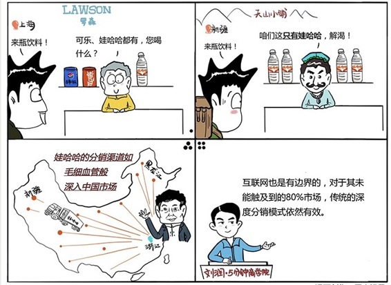

# 051｜进入市场的毛细血管

### 概念：深度分销

> 深度分销策略，就是通过一整套激励和管控体系，让品牌商与海量的分销商之间，形成利益共同体，吸取每一处的微小流量，汇聚成滔天大河。

深度分销的大前提，是靠大量利润养育和高定倍率。

### 案例

中国富豪榜上，最近十年变化很大。以前主要是房地产商，现在主要是互联网公司。但是，这两个行业之外，居然有个卖水的能跻身十大，甚至一度成为中国首富。他就是娃哈哈的宗庆后。

我们在第7期课程中，讲过“定倍率”的概念。定倍率，就是零售价，比上成本价，或者出厂价的倍数。如果你上网易的成本控栏目看一下，就会知道，一瓶售价1.5元的矿泉水，里面的水的成本，大概是1分钱。如果用定倍率的眼光来看，这是要吓死人的。那我花的1.5元中，其他的1.49元，都付给了谁，买了什么呢？那1.49元，除了支付瓶子成本，广告成本，留存厂家利润外，60%，都给了渠道。

营销是为了提高“或然购买率”，渠道是为了提高“商品可得率”。所以，这60%的钱，最主要的目的，是让娃哈哈无处不在，消费者触手可及。为此，宗庆后做了不少事情。第一，他在中国31个省市选择了1000多家有实力的经销商，把钱分给他们，让他们把大树的根系像毛细血管一样，触达所有有人的地方。第二，他把渠道不断下沉，最初娃哈哈面对省级代理，到后来直接面对市级代理，然后直接面对县级代理，每一个城市都有人深耕，销售总量，也因此几乎翻倍。

同为曾经的中国首富，网易的丁磊曾对卖水的生意不屑一顾。但是，有一年，他去新疆旅行，在天山深处，口渴想买饮料时，发现买不到可口可乐，买不到百事可乐，但却能买到娃哈哈。丁磊从此对娃哈哈的渠道和宗庆后本人非常佩服。

### 运用：步步高系的OPPO和vivo

场景：

> 最近有两家公司，在极其惨烈的智能手机的竞争中，绕开苹果、三星、小米、华为，居然花了几年的时间挤进了出货量前十，甚至前五，让很多人大跌眼镜。这两家黑马公司，其实都是老马，他们都是步步高系的OPPO和vivo。连雷军最近都在说，反思小米这些年的快速成长，我们有一个失误，就是只抓住了互联网上的20%的消费者，却没有对线下依然坚固的80%的消费者足够重视，线下渠道部署不够。

雷军的反思很值得不少互联网公司深思。移动互联网把用户从0%，提升到20%，已经很快了，可以说是翻天覆地的变化。但是，还剩的80%今天依然是消费主体。OPPO和vivo只不过是使用了传统商业中一套极其笨拙，成本极高，但是极其有效的打法：深度分销策略。

他们在线下分别拥有20万和15万，共计35万个销售终端，销售终端只要进一批OPPO的手机，比如10台，和摆放一个销售柜台，OPPO就派促销员上门。所以，你在很多城市，一旦进了一个手机连锁店，就会有人给你推荐买OPPO的手机。这种全面撒网、一杆到底的深度分销策略，让他们在互联网销售不能顺利触达的三、四线城市，成为王者。

当然，成为王者的代价，就是它也必须提高售价，然后拿出足够的利润，分给饥渴的渠道。这也导致了OPPO和vivo被诟病，这样的性价比，可能只能在三四线信息不对称的市场获得成功。

### 小结：如何运用深度分销策略

这个策略对大部分人的意义在于：

第一，理解互联网也是有边界的。触达互联网20%的消费者边界之外的80%的市场，传统渠道模式虽然看上去笨拙，但却依然有效。你可以称之为“农村包围城市”。

第二，理解中国是一个复杂市场。在一、二线城市人尽皆知的东西，在三四线城市可能还是新鲜理念。所以，如果看不懂互联网，可以干脆反其道而行之，扎入三四线城市，寻发展。

### 互联网时代深度分销的意义：

虽然今天有20%的消费者习惯网上购物，而且越来越多，但毛细血管里依然有80%的消费者，习惯线下购物。收集这些流量，是深度分销的现实意义。