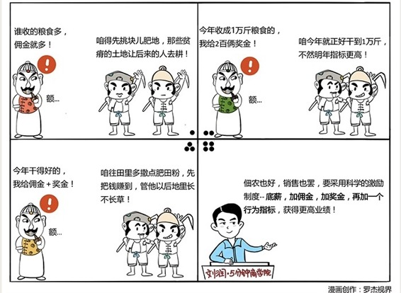

# 052｜如何把销售变成虎狼之师？

### 概念：直接销售

> 对不少企业来说，我卖自己的产品，没有渠道，更没有深度分销。我就是雇了10个销售，让他们卖东西；如果雇了100个销售，就再多雇10个销售经理。我只关心一件事情，就是：卖货，卖货，卖货。我们把这种销售模式，叫做直接销售。

大部分公司的直接销售，叫“销售部”。有些公司有分销渠道，也有直接销售，他们用直接销售面对最重要的客户，所以又被称为“大客户部”。

### 延伸：激励销售的两大流派：佣金派和奖金派

佣金派认为，销售人员的收入，应分为底薪+佣金。底薪是旱涝保收，佣金则是销售额的一个比例。比如，底薪3000元，提成5%。那么，如果销售员卖了1万元，就能拿5%，也就是500元提成，总收入3500元。如果卖了10万呢，就能拿5000元提成，收入可达8000元。

对于产品线复杂的公司，比如化妆品，可以根据产品记点值，卖一盒眼霜30点，一只唇膏12点，然后把点数加一起，乘上单价，比如10元一点，就可算出佣金。

佣金派的方法看似简单粗暴，但非常有效。激励相容，能燃起大家的斗志：卖越多，分越多。

### 但佣金派也有两个问题。

第一，无法对市场的贫瘠富裕，区别对待。比如，在上海卖化妆品，可能就是比青海好卖。按销售额拿佣金，那就没人去青海开拓市场了。每个人都会尽量“捡”客户，而不是“挖”客户。

第二，无法判断业绩算是低，还是高。10万是这个地方的合理业绩吗？这个地方换个人，是否能卖到30万呢？

所以，很多机构做大了以后，都会加入“奖金派”。

奖金派的基本逻辑，是底薪+奖金。设定一个销售指标，一个与之对应的奖金包，然后根据对指标的完成情况，按比例获得奖金。比如销售指标10万元，奖金包5000元。如果完成6万，可拿3000元奖金。那超过10万呢？还有超额奖金。

奖金派很好地解决了区别化对待，销售业绩合理性的问题。比如上海销售指标100万，新疆10万，但奖金都是5000元。这样，在新疆卖5万拿到的奖金，和在上海卖50万一样。这就可以通过分别调节销售指标，以及奖金包，来鼓励优秀人才开拓新市场。同样，如果在上海卖100万太容易了，可以奖金包不变，单独调高销售指标。反过来，如果销售指标合理，奖金太低，吸引不了人才，也可以单独调高奖金包。

所以，如何激励销售，是有大学问的。在一些大机构里，甚至为奖金设了“及格线”，10万指标，如果你连6万都没做到，说明当时承诺时太草率，就别想奖金的事了。激励题到最后，都是数学题。

但奖金制度也有重大的问题。销售一定希望指标越低越好，分解指标时，说不定都能打起来。公司也一定希望在指标完成后，拨动棘轮，不断提高明年指标。

很头疼吧。东西还没开始卖，就这么复杂了。那怎么办呢？

### 运用：底薪+奖金+佣金的“鸡尾酒疗法”

公司给销售还是要定指标，比如10万，然后确定一个奖金包，比如5000元和一个提成比例，比如10%。如果销售完成了6万元，不到10万的指标，那么，按比例拿奖金，可得3000元。但如果卖得超过10万元，比如16万元，则10万元销售指标对应的5000元奖金全得。此外，额外的6万销售额，按照10%拿佣金，再得6000元提成。他就一共可得3000元底薪，加5000元奖金，加6000元佣金，共1.4万元。

这种鸡尾酒式的激励制度，兼顾了底薪、佣金、奖金这3种方式的特点，被越来越多的机构接受。

### 小结：底薪+奖金+佣金之外，还要加上一个行为指标

在底薪+奖金+佣金激励制度下，销售人员可能只在乎短期利益，会为了佣金和奖金，欺骗式销售，严重影响客户满意度，给企业造成长远伤害。

于是，在这三者之外，很多机构又加上了一些行为指标，比如用新客户相对于老客户的比率，衡量是否不断扩大到新市场；用利润指标，衡量是否大出血式销售；用客户满意度，衡量是否只在乎短期利益；用销售人员流失率，衡量团队是否可持续经营。

底薪，加奖金，加佣金，再加行为指标。你现在可能已经明白激励销售，不是“兄弟们，跟我上”这么简单。只有适合当下的，科学的激励制度，才能把你的销售团队变成虎狼之师，但又不会误伤自己。