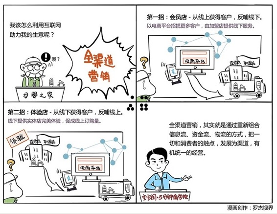

# 053｜把一切的触点，发展为渠道

### 概念：全渠道营销

我们把整个商业，分为创造价值和传递价值两个过程。海尔主体是创造价值，苏宁主体是传递价值。传递价值主要传递三件事情：信息流、资金流、物流。

全渠道营销，就是利用最新的科技和最有效的手段，把信息流、资金流、物流重新高效组合，用一切可能的方法，接触消费者。

### 案例

> 线下的母婴店，就是三流合体。消费者先来看东西，看价格，检查保质期，和售货员沟通，这是获得信息流；然后通过现金、信用卡，或者手机支付，启动资金流；母婴店把奶粉运到店面，消费者再把奶粉拿回家，是两段物流。母婴店，是一种形态的三流合体。

互联网的到来，把三流重新组合了。

> 阿里在2015年推出一个活动，叫三八扫码购。3月8日那天，你冲进大超市，用手机天猫扫描商品条形码，就会发现，很多商品天猫更便宜，这时天猫鼓励你在网上下单，然后快递送到你家。过去，信息流，就是看东西，资金流，就是付款，物流，就是大包小包拎回家，都是在超市里完成的。但天猫通过扫码购的方式，让你在超市里完成了信息流的获取，却通过天猫下单，截获了资金流，并用快递给你补齐了物流。立刻，所有的超市，都变成了天猫的线下体验店。

后来，善用“规则之缝”的黄牛先生又如期现身了。他们非常敏锐地冲进超市，把所有商品的条形码都扫了一遍。然后，把天猫上更便宜的商品的条形码拍下来，印成了一本册子。黄先生们拿着这本册子进了北京地铁，问等地铁的市民：你们要不要扫一扫？市民将信将疑一看，都是比超市便宜的东西。黄先生说，一元钱扫一次。你想想，黄先生手上的这本册子，是不是就变成了一个折扣超市？黄先生完成了信息流，而支付宝完成了资金流，顺丰完成了物流。

### 运用：如何借助全渠道营销，重新组合信息流、资金流、物流呢？

给你介绍两种方法，会员店和体验店。

> 第一，把信息流、资金流的一部分，搬到公共的或者自有的电商平台，用以获取更多客户、支付款项，但是物流依然放在线下，请直营店、加盟店提供线下服务，并因此把合理利润分配给他们。我们把这种模式，称为“会员店”。统一价格，网上其实是会员管理系统。在过去，线下加盟店很抵触电商，是因为电商抢走了他们的客户。品牌商和零售商变成了博弈的关系。通过这种模式，品牌商从互联网上获得新的客户，依旧归属就近门店，线上线下协同，获得更多的流量，给客户提供更好的服务，增加利润。

> 第二，把信息流依然放在线下，把资金流和物流，搬到电商平台。我们把这种模式，叫做“体验店”。因为线上、线下的成本结构不同，线下销售的成本加成，几乎一定比线上高。所以，品牌商可以考虑把所有的加盟店收回，变成合作经营的体验店，以收集线下流量。体验店以展示商品的美好体验为主，而不再以销售为目的。你可以直接在网上买。如果不放心，可以去体验店进一步试用。觉得不错，可以当场拿走。你觉得，啊，线下怎么更贵啊？那是因为有店租，有库存。你不现场买可以，也可以回到网上下单，会便宜一些。但是，不管你在哪里下单，买的，都是这个品牌商的。

### 小结：认识全渠道营销

全渠道营销，就是通过重新组合信息流、资金流、物流的方式，把一切和消费者的触点，发展为渠道，有机统一的经营。今天介绍了两种线上与线下结合的全渠道营销方式：会员店和体验店。会员店，是从线上获得客户，反哺线下；体验店是从线下获得客户，反哺线上。