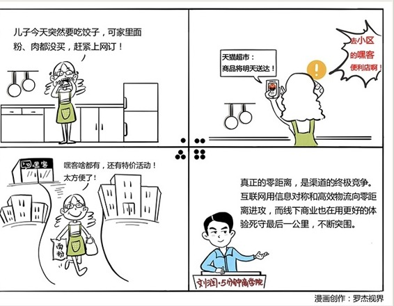

# 054｜离消费者越近，越有价值

### 概念：社区商务

社区商务，就是用距离上的“近”，来抗衡物流上的“快”，从而形成一道屏障，成为无法被互联网取代的商业风景。

### 案例

> 我把离你家5公里的距离圈，叫作商圈。人们之所以去沃尔玛购物，是因为它的商品极其丰富，并且价格相对便宜。但是，你要开车5公里，或者坐班车才能购买。这种通过牺牲距离效率，获得现场观察商品机会的商业模式，最先受到互联网的冲击。1号店、天猫超市，品种更全，价格更低，而且第二天送货的物流效率，对大量懒人来说，比离家5公里更便捷，所以大超市开始普遍受到冲击。苏宁、国美、麦德龙、红星美凯龙等等“商圈”之王，也在受冲击的行列。

我把离你家1公里的距离圈，叫作社区。我今天吃完晚饭下楼散步，特别想喝一杯酸奶，我想问你，这时候你会去1号店买吗？我不会，因为在1号店买，再快，也要第二天早上到。这时，足够地“近”，就开始发挥优势了。1公里距离圈，开始有效地狙击互联网的物流系统，体现出生命力。

### 运用：更极致的方式—小区和家庭

小区是100米之内的范围。

现在有企业免物业费去做小区的物业服务，它赚的是各种服务的钱，比如业主订餐可以打电话给我，我再找相应的饭店买过来，赚饭店的钱。它还可以掌握小区业主的消费记录，衍生出各种商业模式。比如各种广告、快递箱，等等。地产商开发社区经济有天然优势。以社区商务为主要概念的“彩生活”在香港上市，以高达六十倍的市盈率发行，成为港股房地产类上市公司中的“黑马”。

比小区更近的是家庭。家庭，是真正的零距离。小米、华为、海尔都在做智能家居，这里面有很多商机，因为，未来离消费者最近的，可能就是智能家居。例如洗衣机、冰箱能上网之后，都可以成为新的渠道，向服装企业、食品企业下订单，你刚起念，就能完成下单。你想象一下，你的冰箱能智能识别冰箱里的食物，牛奶快要过期了，它提醒你喝掉，或者做一个奶白鱼汤吧；当鸡蛋只剩6个的时候，它自动向1号店下单；你在朋友圈说周末想吃酸菜鱼，它自动根据菜谱，买好相关材料，并在周五晚上送到。智能家居，是零距离的渠道。

### 小结：认识社区商务

社区商务，就是在移动互联网时代，用距离上的“近”，来对抗物流上的“快”的一种商业模式。简单来说，从5公里的商圈，到1公里的社区，到100米的小区，到零距离的家庭，离消费者越近，越有竞争优势。

线下商业不会被替代。互联网在用信息对称加上高效物流的方式不断向零距离进攻，而线下商业在用更好的体验，死守最后一公里，并不断突围。真正的零距离，是渠道的终极竞争。