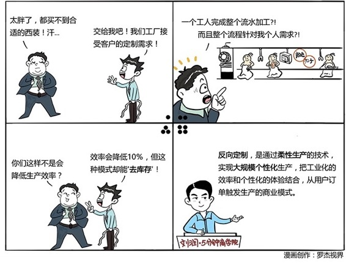

# 055｜去掉渠道最大的顽疾：库存

### 概念：反向定制

反向定制，就是通过柔性生产的技术，实现大规模个性化生产，把工业化的效率，和个性化的体验，结合起来的一种从用户订单，触发生产的商业模式。

### 案例

> 见过我的朋友都知道，我长得比较瘦。好吧，其实是非常瘦。所以，我很多衣服，尤其是西装、衬衣，都是定制的。定制合身，但就是价格比较贵，所以，一直没有完美的解决方案。

我有个企业家朋友，叫做张蕴蓝。她在青岛有个西装工厂，叫做红领西服。有一天，她对我说，润总，你的西装啊，就交给我来负责吧。

于是，她派了一个小姑娘，在我身上19个部位量了22个数据。然后，我们坐在电脑面前。你们知道，西装的领口可以选向上斜、也可以向下斜；袖口的扣子，是4颗、还是5颗，可以选；门前的扣子，一粒还是两粒，可以选；衣服的里衬，是麻的还是绸的，也可以选。然后，我的身材数据，和喜好数据，就通过互联网，进入了她的西装工厂。

### 运用：背后的商业逻辑

我专门请张蕴蓝带我去参观了她的工厂。

一台巨大的机器，在我选的那块布上，一刀切下去。我参观过不少服装工厂。以前大家的做法，是在桌面上叠放了厚厚的一摞布，最上面，再铺上一张画好的衣版。然后，一个熟练的工人，推着一把垂直的裁刀，一路裁下去。最后，这一摞布，都会做出一模一样的衣服，这就叫：工业化。

但她不是，她就只为我裁一张布。裁完后，在布片上，钉上一个RFID的芯片，然后挂在杆子上走流水线。走到一个缝纫女工面前的时候，女工用这个芯片，“嘀”地碰一下缝纫机上的小电脑，电脑就会告诉这个女工，这块布，应该用什么颜色的线，套上什么样的扣子，和哪块布缝在一起。然后女工开始换线，缝布。

就这样，一直到最后，走完整件西装的生产流程，我忍不住问张蕴蓝，你这么做，其实不是降低了效率吗？让一个女工，一天只做一个动作，效率不是最高的吗？

> 她说，是的，生产效率确实降低了。本来一个女工一天可以做100件衣服的，现在只能做90件了，效率降低了10%，但是你知道吗，我干掉了服装业的这个顽疾：库存。从客户下单、付款开始，这件衣服并不存在，我收到订单开始反向定制，因为完全没有库存，我一件衣服的综合成本，只有成衣的一半，甚至三分之一左右。

通过改造生产线，实现柔性的大规模反向定制，她说，我们可以做到下单后的7天，衣服送到你家。你想想，花一半的钱，可以买到一件和成衣同品质的西装，还是完全为你定制的，你为什么还要买成衣。

### 小结：使用反向定制的几个建议

第一，反向定制的前提，是模块化。在3D打印之前，完全的定制，是无法工业化的。所以，所谓的定制，主要是基于对产品的模块化分解。你的产品，可以模块化吗？

第二，反向定制的技术，是柔性化。所谓柔性化，就是通过改造生产线，能够实现小批次，最好是单件的生产，能够缩短生产周期，比如7天，甚至1天。小批次，短周期的柔性化，是反向定制的技术基础。