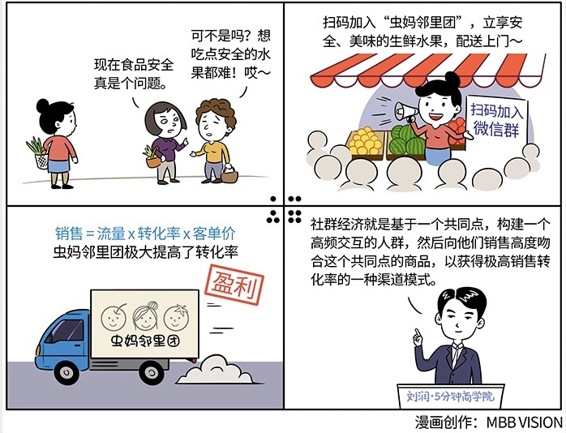

# 056｜自带高转化率的流量

我花了整整四周的时间，与你分享“企业能量模型”的概念，以及其中的产品、价格、营销、渠道四大要素。还记得吗？经营企业，就像是推巨石上山。做产品，是把这块千钧之石推上万仞之巅，获得尽可能大的势能，然后在最高点一把推下去，用营销和渠道减小阻力，把势能转化为最大的动能，获得尽可能深远的用户覆盖。

可是，互联网时代来临了。有什么新的推石头方法和新的推石头工具，能更有效地帮助企业能量的生成与转化吗？本周，我们将专门讨论这个话题。

### 概念：社群经济

社群，就是因为某个共同点而聚在一起的人群。从我们今天说到的销售公式，“销售=流量x转化率x客单价”的角度来看，因为这个共同点，社群，就是自带高转化率的流量。

社群经济，是基于这个共同点，构建一个高频交互的人群，然后向这个人群销售高度吻合这个共同点的商品，以获得极高销售转化率的一种渠道模式。

### 案例

> 上海有一个很有意思的生鲜电商：虫妈邻里团。当大部分生鲜电商，一上来就想要席卷天下时，虫妈邻里团则是在偌大的中国找了个小角落，用社群经济的方式，苦心经营根据地。

> 2014年，特斯拉还很稀罕的时候，创始人“虫妈”在家门口搞了一个“美女香车卖水果”的活动，吸引了很多邻居，邀请他们扫码加入微信群。都是邻居，看起来也确实不像是骗子，也就加入了。就这样，每天摆摊卖水果，每天吸引二三十个邻里入群。他们就用这种现在看起来很原始、低效率的方法，完成了种子用户的积累，形成了一个越来越大的社群。

> 这个社群能聚在一起，因为有两个共同点：共同的兴趣，大家都担心食品安全，都想吃到美味安全的水果。共同的位置，大家都住在同一个社区，都是邻居。别小看这两个共同点，它们解决了生鲜电商的两个大问题。

> 第一是库存问题。先批发水果，再摆摊零售，就一定会有库存和损耗的问题。虫妈邻里团把追求安全、美味的生鲜水果的人群聚在一起后，先收集他们的需求，再反向按需采购，这就解决了库存问题。

> 第二是物流问题。对大型生鲜电商，即使这个城市只有一个客户，他都要部署复杂而完备的物流体系。但是，在虫妈邻里团，因为大家都是邻居，所以配送非常简单，物流成本极大降低。

中国4000多家生鲜电商中，只有1%实现了赢利。虫妈邻里团现在几十个群，1.6万户人家，却已经赢利。赢利关键是，下了单再采购，库存时间最短；送到固定提货点，物流成本最少。

### 运用：背后的商业逻辑

我们知道，“销售=流量x转化率x客单价”。

潜在客户通过某种渠道进入你的销售漏斗，比如进了你的门店，访问了你的网站，在微信里向客服咨询，就是“流量”。

这个潜在客户可能会下单，也可能不会。有多少潜在客户，最后下单，就是“转化率”。你的商品，和客户需求的匹配度，很大程度上影响着转化率。

下了单，会买多少东西呢？买完衬衫，有没有搭配一条领带？买了领带，有没有配套一个袖扣？每一个客户，每一订单，消费的价格，叫做“客单价”。

社群经济，为何让虫妈邻里团能成为赢利的1%？不是因为它比天猫有更大的流量，而是因为，它卖的高品质生鲜水果，非常契合这个社群的共同点：追求安全、美味食品的邻居。所以在销售公式中，虫妈邻里团极大提高了转化率。

同样的道理，这也是为什么罗辑思维能卖书。因为罗胖卖的书，契合了这个社群的共同点：求知好学的网友。你试试让罗辑思维卖水果，让虫妈邻里团卖书，效果可能都会大打折扣。

### 小结：如何寻找社群经济呢？

想要开始社群经济：

第一，找到一个共同点；

第二，用一个载体，比如微信群、公众号、网络论坛，聚集符合这个共同点的人群；

第三，给这个人群提供最符合他们的共同点的商品。