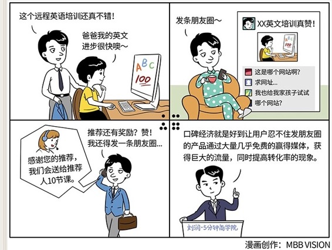

# 057｜自带流量的粉丝

### 概念：口碑经济

口碑经济，就是产品好到了一个程度，让用户“忍不住”发到朋友圈，显著提高了销售公式中的流量和转化率。口碑经济是移动互联网时代，那些真正好产品的红利。

### 好产品的定义：

在过去，在各行各业，好产品有很多不同的间接标准。但是在移动互联网时代，好产品开始有了统一的直接标准，那就是：

> 好到用户忍不住发朋友圈。

在传播上，一直有一个叫做POE的概念。P指的是Paid Media，就是“付费媒体”，比如在报纸上登广告、冠名赞助电视节目等；O指的是Owned Media，就是“自有媒体”，比如企业自己的公众号、官网等；E指的是Earned Media，就是“赢得媒体”，指不属于你，但你也没花钱，别人自发的传播。这是传播的最高境界。今天微博、微信朋友圈，就是被移动互联网放大了的赢得媒体。好到用户忍不住发朋友圈，就是获得了大量的“赢得媒体”。

### 案例

作者儿子叫小米，今年8岁，他参加了一个基于互联网的远程英语培训。你知道，教小孩子英语不简单，除了母语是英语外，你最好懂一些儿童心理学。小米参加的这个培训，是请美国的小学老师，通过互联网，教中国小孩子英语。作者觉得很有意思，站在旁边看了一整节课，发现小米很喜欢，效果也确实不错。

于是，作者就“忍不住”，“忍不住”这三个字非常重要，拍了一张照片，分享到了朋友圈。

他的微信里有几千个好友，很多都是我的企业家学员、各大公司高管、业内知名人士、商界大咖和领军人物。所以，他分享产品非常慎重，因为这代表他的信用。经常有企业家朋友对我说，润总，你朋友多，我们付钱，在你的朋友圈宣传一下这款产品可以吗？这些我都是拒绝的。因为，我宣传的每一样的东西，都被我的信用背书。

所以，你知道为什么我常常会“忍住”。但这一次，没忍住。

果然，发完后，很多朋友留言、或者私信他：润总，这是哪个网站啊？我也想给我家孩子试试。于是，作者就告诉了他们。

过了几天，他们又都回来了：润总，你当时是用哪个名字注册的啊？我说，你问这个干什么？他说，那个机构告诉他，他们会给推荐人也送10节课。我一听，这是好事啊。然后，我的账户里，就多了很多课。

作者特别高兴，又“忍不住”想再分享一遍。

他的第一次忍不住，和第二次忍不住，是不一样的。第一次忍不住，是因为这个产品好到了一个程度，让他愿意用个人信用为它背书。第二次忍不住，是受到了奖励。

### 运用：如何利用口碑经济的逻辑，获得免费的“赢得媒体”？

第一，真正的站在用户角度，做好产品，不断交互，不断测试，让产品好到用户忍无可忍，觉得不发朋友圈，就是对不起自己的朋友。为此，要不遗余力。否则，口碑经济，就不是你的红利。

第二，在你的产品中，可以刻意加上一些值得传播的东西，比如“我出钱请5个朋友免费阅读”，“我今天走路的步数，击败了93%的好友”等等。

第三，也可以适当地使用一些激励政策，比如前面提到的赠送课程，比如饿了么、大众点评、滴滴打车，消费完都可以分享红包给朋友。

### 小结：认识口碑经济

口碑经济，就是移动互联网时代，因为传播成本被极大降低，好到让用户忍不住发朋友圈的产品，可以通过大量几乎免费的赢得媒体，获得巨大的流量，同时提高转化率的商业现象。

运用方法：第一，当然你的产品真的要好；第二，可以试着在产品功能外，增加一些传播元素；第三，适当的奖励，可以增加传播动力。