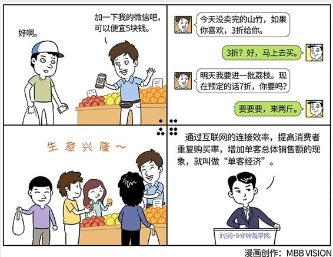

# 058｜终生免费的流量

概念：单客经济

单客经济，就是利用移动互联网，建立直接的、高频的互动，从而促使消费者重复购买，发挥客户终生价值。

重复购买，是每一个企业家梦寐以求的目标：客户终生价值（Customer Lifetime Value），就是一个客户，一辈子一共在你这里买多少东西。

通用汽车的负责人曾说过，一个通用汽车客户的终生价值是7万美元。不过，这个问题在企业与消费者连接很脆弱的情况下，很难实现。

### 案例

> 你去水果店买水果，50块钱。老板说，加一下我的微信吧，可以便宜5块钱。你觉得挺好啊，就加了老板的微信，反正可以对他关闭朋友圈。

> 晚上7点钟，他在微信里说，我有一批今天刚进的，没卖完的山竹。如果你喜欢，下来散步的时候，可以过来买一些，3折给你。

> 这也太便宜了吧。这是因为水果今天卖不出去，明天就不新鲜了。3折就当清库存了。你觉得很划算，说不定会买一些。

> 晚上10点钟，他又对你说，明天早上，我要去进一批深圳南山空运来的荔枝。你现在定的话，7折。为什么能7折？因为你先预定，他再采购，完全没有摆摊的损耗。你觉得很划算，说不定也会买一些。

> 这家水果店的生意越来越好，旁边店的生意，越来越差。其他店都不知道发生了什么。这家店，通过直接、高频的连接，把你变成了“重复购买”的客户。这种通过互联网的连接效率，提高消费者重复购买率，增加单客总体销售额的现象，就叫做“单客经济”。

#### 运用：实现单客经济的三个建议

第一，建立用户容器。水果店老板加微信，就是一种最简单有效的方式。如果用户数量比较多，微信群也不错。但要注意，微信群里，坏消息有巨大的传染性。对自己产品信心不大的，慎用微信群。掌控欲望强一些，互动需求特殊一些，可以用自己的APP。但也要注意，独立APP获取初始用户，会漫长而艰难。如果你希望单向广播，朋友圈、微信公众号等，都是不错的容器。

第二，迈过黏性边界。有赞的白鸦说过，10%的消费额，是黏性边界。你周边小区有多少住户，在你这里买水果的有多少家庭，一个家庭一年在水果上消费多少钱，如果是1万块钱，在你这里消费有没有超过1000块。如果不到10%，说明他对你没有黏性，或者说他对你没有那种信任感。随着人们对消费品质的要求越来越高，更愿意去消费那些习惯性信任的东西，而不是最便宜的东西。当然便宜永远都是重要的，但是有一个比便宜还重要的东西，就是“对便宜的信任”。没有这种信任，这个客户是会随时抛弃你的。

第三，满足关联需求。怎么才能迈过黏性边界呢？企业应该想的是，我对这个单客的价值够不够大。你不能说，一个水果店，我就只卖这种水果，那不行的，你甚至可能发现水果店里应该卖零食啊。服务一个客群，提供丰富价值，总之我要覆盖超过他10%的消费。这个思路类似于前面提到的“社群经济”，基于所会聚人群的共同属性，为其提供多样化的产品或服务。

### 小结：认识单客经济

单客经济，就是利用移动互联网，建立直接的、高频的互动，从而促使消费者重复购买，发挥客户终生价值。单客经济提高了销售公式“销售=流量x转化率x客单价”中的第三个变量“客单价”的次数。单客经济，就是终身免费的流量。

运用单客经济的三个建议：建立用户容器，迈过黏性边界，满足关联需求。