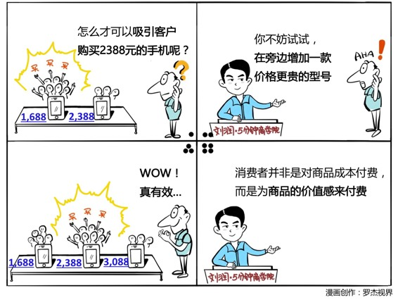

# 005｜拉个垫背的，显示你便宜

概念：价格锚点

价格锚点是在1992年的时候，有个叫托奥斯基的人提出的，他认为消费者在对产品价格并不确定的时候，会采取两种非常重要的原则，来判断这个产品的价格是否合适。

第一个原则，避免极端。

第二个原则，权衡对比。

案例

出差住酒店，选择酒店上网付费方案，一个是80元1小时，一个是105元1整天。我毫不犹豫地选择了105元1整天的方案，付费后立刻发现，80元唯一存在的价值，就是让我觉得那105元非常划算，80元就是所谓的价格锚点。

运用：场景

场景1：

原来只有1399和2288两款净水器的时候，大家都买1399的那款，而你特别想卖2288那款。最简单的办法是，让产品部门再去生产一款4399的净水器。这时候，你就会发现2288的版本会卖得比以前好很多。

场景2：

假如你有个体检的产品是600块，如果你这样说：“您一年愿意花6000元的价格来保养您的汽车，为什么却不愿意花600元来保养您自己呢”？很可能会打动很多人。这会让客户觉得，我花6000块钱保养车子，难道人还不如车子吗？这时候，600块钱的体检方案，价值感就会非常明显。

小结：引导购买的两个原则

第一、避免极端。就是在有3个或者更多选择的时候，很多人不会选择最低或者最高的版本，而更倾向于选择中间的那个商品。

第二、权衡对比。当消费者无从判断价值是高还是低的时候，他会去选择一些他认为同类的商品去做对比，让自己有一个可衡量的标准。

消费者其实并不真的是为商品的成本付费，他是为商品的价值感而付费。价格锚点的逻辑，就是让消费者有一个可对比的价格感知，你明白了吗？

这是《5分钟商学院》陪你成长的第5天，期待你的进步。