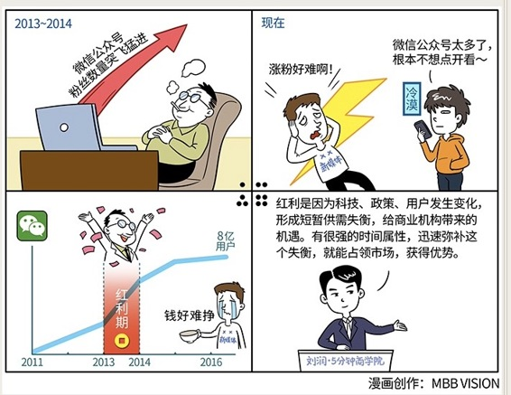

# 060｜会冲浪的人，必须也要会游泳

### 概念：红利理论

红利，就是因为科技、政策、用户发生变化，形成短暂供需失衡，给商业机构带来的机遇。红利有很强的时间属性，迅速弥补这个失衡，就能占领市场，获得优势。这也是为什么张瑞敏说：没有成功的企业，只有时代的企业。

### 案例

> 微信是2011年成立的，到2016年，微信全球已经有了8亿用户。在2011年最开始，和2016年最近这段时间，微信用户增长是相对缓慢的。而在这中间，尤其是2013、2014年，微信用户突飞猛进增长。所以在那段时间，你随便做一个微信公众号，比如叫“冷笑话精选”，或者“假装在纽约”就可以有很多关注。因为在那个时候，你是在和荒芜竞争。那段时间，就是微信的红利期：用户已改变，而商家还没有。罗辑思维、吴晓波频道，都是享受了这段红利。

> 但现在，微信里已经有了2000万个公众号。用户打开公众号的总时间不变的话，平均在每个公众号上的时间显著降低。今天，就算你比罗振宇更有才华，你比他好100倍，你都很难做个什么思维，超过他了。因为他是通过和荒芜竞争，获得优势，而你是在和充沛竞争。红利，已经被先入者吃完。

> 所以，我想你已经明白，红利，是一个时间属性很强的东西。它是因为某些基础要素发生变化，而产生的短暂供需失衡。抓住这个短暂的失衡，迅速占据市场份额，然后建立护城河，就有机会成就新的商业帝国。

### 运用：如何抓住稍纵即逝的红利呢？

#### 第一，关注科技的变化。

每一次重大的商业变革，无外乎都是因为一个基础要素发生了变化，比如政治，比如科技。一种新科技的商用化，可能会极大提高生产力。我们都学过，生产力决定生产关系。所以，科技的进步，一定会最终改变所有牢固的商业模式。比如，电商对零售业的改变。密切关注科技进步，保持思考：我的行业如何利用这项科技提升效率。

#### 第二，关注政策的变化。

政策的变化，是商业变化的一个重要变量。比如，汇率的改变，可能会影响外贸生意；人口结构的改变，可能会影响制造业成本；利率的调整，可能会影响固定资产投资；四万亿的投入，可能会带来基础建设的繁荣等等。

#### 第三，关注用户的变化。

美国一波的经济发展，是被战后婴儿潮带动的，中国也类似。60-70后是中国的购买主力。这些人到了什么年龄阶段，买什么，什么行业就赚钱。关注这些人消费习惯的变化，就有机会抓到消费趋势的红利。年轻的90-00后，全新生活习惯慢慢形成主流，也会带来新的红利。

### 小结：红利不是商业模式

抓住红利后，想要获得长久的成功，最终还是要回归核心竞争力。不要把红利当成商业模式，更不能当成是核心竞争力。要有抓住红利的能力，更要有区别红利和核心竞争力的智慧。