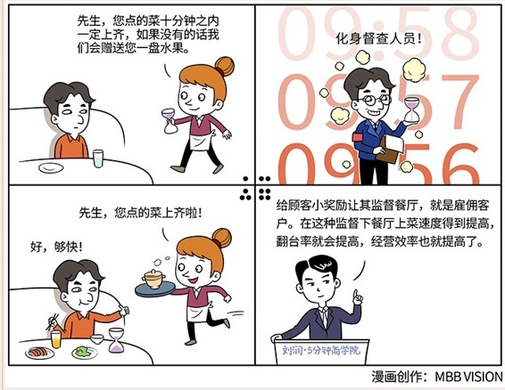

# 062｜让客户帮你管理员工

### 概念：雇佣客户

> 雇佣客户，就是先给顾客一个预设的奖励，比如一盘水果，然后在他面前放一个计时的沙漏。这两个东西放在一块儿，给他奖励，给他工具，你的顾客就被雇佣上岗，来帮你检查上菜的时间了。

像刚才那个火锅餐厅，如果没做到10分钟上菜，餐厅就给你送盘水果。这水果并不贵重，点个果盘，可能三五十块钱，可这个果盘的成本，也许只有5块或者10块。你用5块或者10块的成本，雇佣了一个顾客成为你的“员工”，来检查这家餐厅的上菜速度。

这种方式的好处是，每一家餐厅的每一个时间点的每一桌菜品的检查率都是100%。这样，餐厅经营的行为指标，就是那个“上菜速度”，就可以得到非常好的贯彻。

上菜速度得到提高，翻台率就会提高；翻台率得到提高，餐厅的经营效率就会提高；经营效率得到提高，餐厅的收入，也会因此大大提高。

### 延伸：翻台率

一家餐厅的总收入，大概可以用每桌所点菜品的价格，乘上餐厅的满座率，乘上每桌的翻台率。翻台率指的就是一张桌子，一天能接待多少波的客人。

餐厅中的翻台率，和零售业、投资界中的周转率，是类似的概念。一天的翻台率是两次，和三次，会有非常大的差别。我在上海投资了一家小龙虾店，所以我知道，如果增加夜宵，能把翻台率做到四次、五次，这可能直接决定了你的店是亏损，还是盈利。

### 提高翻台率有两个办法：

第一个办法，是让客户吃得尽量快一点，比如在肯德基里面，放快节奏的音乐，用硬凳子等等，都是这个目的。但是，你只能暗示，客户吃得快和慢，这事儿不是你能完全决定的。

第二个办法，就是提高自己的上菜速度，通过减少客户的等菜时间，来提高翻台率。上菜速度，是餐厅可控的，并且有效地提高翻台率的因素。

### 运用：“雇佣客户”的小逻辑

场景1：通过小费提升服务水平

> 很多人都知道，在美国用餐，是有给小费的习惯的。你根据自己的满意度，给服务员小费。这就相当于把餐费中的一个组成部分，服务员的工资，交给客户来发了。餐厅用“交易”的方式，“雇佣客户”给服务员发工资。不满意，就可以给服务员“扣工资”。国内大部分的餐厅，用“管理”的方式，主观考评服务员，导致有些餐厅的服务员，没给你端上来一盘蟑螂，就觉得对得起你了。

小费，是一种有效的“雇佣客户”，来提升服务水平的手段。

### 场景2：打分点评让服务更好

> 在中国没有给小费的习惯。但是，我们有打分的习惯。你下了车，付了款，专车APP会要求你对这个司机做点评。因为这个点评，专车司机的态度特别好，你冷不冷啊，要不要喝水啊，车上还有WIFI你要不要用啊。

通过一个小小的点评，这个专车APP就“雇佣客户”来提升了司机的服务水平。代价，可能只是下次打车的红包。

### 小结：与客户交易

我们第25期讲的“交易成本”，当管理成本，大于交易成本的时候，这件事情应该交给市场，在企业的外部完成，而不是自己来做。雇佣客户，就是把对员工的管理，变成与客户的交易。