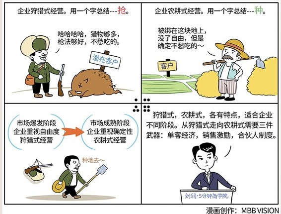

# 063｜你是在狩猎，还是在农耕

概念：狩猎式经营、农耕式经营

### 狩猎式经营：

> 用一个字来总结，就是：抢。猎人获取食物的方式，是去山里去打猎。没吃的了，就去打只兔子。如果一不小心，打到头野猪，可以吃好几天。吃不下的，就晒成肉干，留到冬天。在资源极度丰富的情况下，狩猎给了猎人很大自由度，但代价是不确定性。

对应到商业世界，就是狙击手式营销，打一枪换一个地方，四处投标。反正潜在客户多，枪法好，生意居然也越做越好。遇到难的和容易的，先挑容易的；遇到大的和小的，先挑大的。

狩猎式经营，是市场足够大，竞争对手不够多时，企业抢夺市场份额的常用策略。

### 农耕式经营：

> 用一个字来总结，就是：种。农民获取食物的方式，是下地里去耕种。春天种秋天的，秋天囤冬天的。耕种不像是狩猎，无法“立等可取”，那是积蓄千般辛苦，获得一朝收获。土地，是农民的生命。向土地索取产出，也要呵护好土地，是农民的首要责任。

对应到商业世界，客户就是你的“地”。你被绑在这块地上，失去了自由度，但是换来了确定性。要想客户重复购买，就要依靠优秀的产品，和发自内心的卓越服务，不断提升客户体验，获得客户终生价值。

农耕式经营，是市场格局稳定、竞争对手林立时，企业获得稳定增长的常用策略。

### 农耕式经营的三个兵器：

市场从爆发阶段，走向成熟阶段，企业也从重视自由度，走向重视确定性，从狩猎式经营，走向农耕式经营。

那怎么做呢？我们又打开了“商业兵器库”，从里面挑出三件兵器：第32期的合伙人制度，第52期的销售激励，第58期的单客经济。

第一，单客经济。对销售的考核，从只考核总业绩，变为考核指定城市、指定客户的业绩。过去是“打土豪”，今天要“分田地”。每人分一块地，不管肥沃，还是贫瘠，这就是你的地。你要在这些指定的城市，指定的客户身上，用心耕耘，以追求同一客户重复产出的确定性，而不是今天运气好，又打了几只兔子。把客户关系，和重复购买放在第一位。这就是“单客经济”。

第二，销售激励。分完地之后，再分钱。过去公司用提成制。侥幸猎杀一只霸王龙，整条腿切给你。于是大家都去找恐龙了，兔子没人理。现在，改为奖金制：设定一个销售指标，和一个奖金包，完成多少比例销售指标，就拿多少比例奖金包。根据情况，每块土地的销售指标、奖金包都不一样。这样，你就有机会在新疆种千斤哈密瓜，和在江南种万斤水稻，拿一样的奖金了。土地再贫瘠，只要指标低，也有人愿意耕种了。多年耕耘，再贫瘠的土地，也会肥沃。

第三，合伙人制度。分完钱之后，再分权。合伙人制度，就是一种“联产承包责任制”。你负责这块地，我只拿1000斤。超额部分，你拿6，我拿4。有了当家作主的权利后，他们会想尽一切办法，服务好客户，提高亩产。

农耕式经营，就是先分地，再分钱，再分权。也就是我们讲过的：单客经济，奖金制销售激励，合伙人制度。

### 运用：案例

我在领教工坊带领着一个私人董事会，十几位组员都是各行各业成功的企业家。有一位组员叫崔立建，他创立了一家叫做置诚城市管网的，做不给道路开膛破肚，就能往地下埋管线的，非常传统的工程企业。他在上海狩猎式的攻城略地，做得很成功。发展到一定阶段，他现在也开始慢慢进入农耕式经营。

他把公司从原来的三个事业部，拆散为若干个“联产承包责任组”，指定客户，然后用奖金制，和合伙人制度管理。这些小组，交足了公司的合理利润后的超额利润，小组拿60%，公司拿40%。这个制度，实行不到一年，整个公司的精神面貌大变，业绩暴涨了70%。

### 小结：狩猎式、农耕式

狩猎式、农耕式，各有特点，适合企业不同阶段。从狩猎式走向农耕式，你需要三件武器：单客经济，销售激励，合伙人制度。