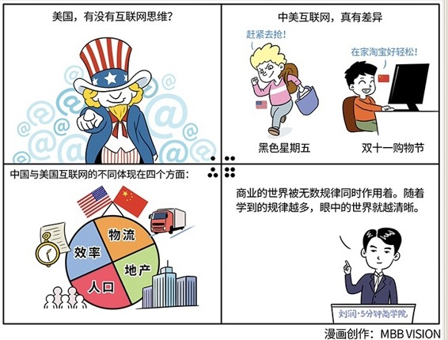
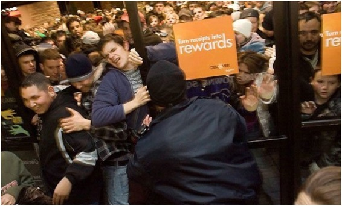
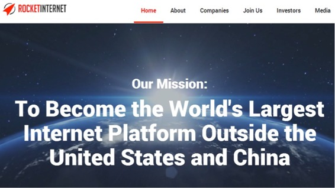

# 064｜美国有没有互联网思维

### 问题：美国有没有互联网

> 学习商业知识，我们能加持企业，更能擦亮看清世界的慧眼。那如何打开“慧眼”呢？我们练习一下。比如，我问你个问题：美国，有没有互联网思维？

要回答这个看似简单的问题，要动用“商业兵器库”中的兵器却不少，比如，第6期的“流量之河”，第7期的“倍率之刀”，第8期的“价量之秤”，第11期的“信息对称”，第13期的“边际成本”，第23期的“机会成本”， 第28期的“人口抚养比”和第53期的“全渠道营销”。容我慢慢道来。

首先，中美互联网，真有差异吗？给大家看张图。

美国最重要的购物节，叫黑色星期五。凌晨大门一拉开，你看看这些人，完全不懂“排队”了，回到了中国很多年前。

那中国呢？我们看另一张图。

中国没有黑色星期五，但中国有双十一啊。双十一后的第二天，某个快递分拣站的包裹，满山满野。2016年双十一，一天包裹的量超过10亿件。

### 讲解：为什么会这样？

中国的互联网比美国更先进了吗？不是“先进”，而是“不同”。这个不同，体现在四个方面。

### 第一，“物流”。

我在第53期“全渠道营销”里讲，所有的销售，最终都是信息流、资金流、物流的万千组合。从渠道的本质分析你就会发现，中美的物流成本非常不同。美国地广人稀，人工昂贵，开个车，送完一户到下一户，要再开半小时。中国呢？骑个小电驴，到了个小区，一栋楼好几件，一个小区估计就送完了。

居住密集，人工便宜，导致中国最后一公里的物流，非常便宜。原来一批廉价劳动力在工厂里，现在跑到路上去了。

这种状态能持久吗？估计难。我在第28期讲过“人口抚养比”，中国劳动力一代代减少，工资一年年增高。90后和00后，多半不愿意做快递，就算愿意，价格也会越来越高。今天你买个100块钱的东西，6块钱送到家。如果有一天，要60块钱送到家，你还会在网上买吗？

居住密集度，劳动力价格，带来最后一公里物流价格不同，使中美电商出现巨大差异。

### 第二，“地产”。

大概从97年开始，中国地产成本不断攀升，所以，今天所有线下零售，很大一块收入，都交了“地产税”。我在第23期讲“机会成本”时说，房地产，是所有行业的机会成本。线下要赚钱，收益必须大于租金。第6期“流量之河”里说，租金又是线下零售的流量成本。电商没这部分成本，于是形成巨大流量成本落差。互联网冲击线下零售，势如破竹。

美国呢？房地产并没有如此疯狂，所以成本落差并不明显。这是中美互联网的另一个差异。

这种状态能持久吗？不一定。线下零售无法盈利，纷纷关门，租金必然下跌，新平衡就会形成。

### 第三，“人口”。再给大家看一张图。

这是一家德国的互联网公司。在它首页上，赫然写着：我们的使命，是成为全世界除了美国和中国之外，最大的互联网平台。

使命是一个公司所能想到的最远的未来，它能想到的最远，也不和美国、中国比了。为什么？因为互联网是一个人口游戏。我在第13期“边际成本”里讲，互联网非常重要的作用，是把边际成本降为零，所以，人口越多的国家，互联网效应越明显。我在第8期讲过“价量之秤”的逻辑，因为人口多，中国企业就可以用日本、德国企业，甚至美国企业都看不懂的方式，把“价量之秤”的砝码，完全拨到“量”的极端。

人口数量，也是中美互联网的重要不同。

### 第四，“效率”。

中国改革开放以来，零售业发展时间不长，还没出现沃尔玛这样的巨头，大量零售企业还在靠信息不对称赚钱，互联网就来了。我在第11期“信息对称”里说，干掉信息不对称，是互联网影响商业的底层逻辑。所以中国零售面临巨大冲击。

美国呢？美国零售业已经非常成熟，效率非常高。沃尔玛，Costco都在极低毛利下运行，梅西百货40%的商品都是自营。相比之下，中国零售业的效率太低。所以，互联网拿起了第7期讲的“倍率之刀”，一刀一刀砍下去。

### 小结：打开慧眼

美国有没有互联网思维？如果你能拿起“商业兵器库”里的“流量之河，倍率之刀，价量之秤，信息对称，边际成本，机会成本，人口抚养比，全渠道营销”来分析，看清楚中美在“物流、地产、人口、效率”四个方面的不同，就有答案了。

商业的世界，被无数规律同时作用着。你只学会一条，会觉得自己天下无敌了。随着你学到的规律越多，你眼中的世界就越清晰，你也越会说“看情况”，以不变应万变。思考时静若处子，行动时动若脱兔。