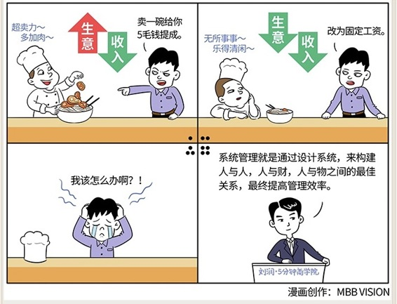

# 067｜分钱，花钱，赚钱

### 概念：系统管理

> 系统管理，就是通过设计系统，来构建人与人，人与财，人与物之间的最佳关系，最终提高管理效率。

美国管理学家弗理蒙特·卡斯特和罗森茨威克认为，公司是一个由各种要素组成的系统，人和其他生产资料一样，都是这个系统中的要素。差别是，人这个要素是主动的，而其他要素是被动的。我们当然要激发善意，这有助于提升“人”这个要素的“主动性”，但同时，也要理清包括人在内的所有要素之间的关系，构建有效系统，才能产生巨大的整体价值。这派观点，被称为：系统管理学派。

### 案例

> 七个和尚住一起，每天共喝一桶粥，但每天都觉得不够。一开始，他们抓阄决定谁分粥，结果，只有在轮到自己分粥的那一天，才能吃饱。后来，他们推举七人中道德最高尚的和尚分粥。结果，大家想尽办法讨好他，贿赂他，各种腐败。再后来，他们组成一个三人分粥委员会，四人评选委员会，结果，大家互相攻击，相互扯皮，粥都凉了还没结果。

> 最后，他们想出一个办法：轮流分粥，但是分粥的人要等其他人挑完后，拿剩下的最后一碗。为了不让自己的最少，分粥的人必须想尽办法平均。从此，大家和和气气，日子越过越好。

这七个和尚，先后使用了四种不同的“管理系统”，结果证明，只有第四套系统，才是最高效的。错误的系统，甚至会把道德高尚的人，变得腐败。

### 运用：如何设计周密的好系统呢？

如何分钱，就是如果赚了钱，你拿多少，我拿多少。比如那个拉面馆，可以先设定一个目标销售额，销售额之内拿工资，销售额之上，拿利润的50%作为奖金。奖金发放的前提，是每月牛肉的耗损量，在正常值20%内波动。这个分钱的方法，能把拉面师傅的利益，和拉面馆绑定起来。作为CEO，要先学会分钱，才能学会赚钱。

如何花钱，就是该花多少，怎么花，谁决定该不该花。比如那个拉面馆，放牛肉是关键的花钱环节，怎么花，谁决定该不该花？最简单的方法，就是最后那一把牛肉，让老板娘来放，让关键资源、关键环节，掌握在关键的人手中。

如何赚钱，就是什么样的目标、战略、流程、任务，被证明是能赚钱的？能提炼吗？能标准化吗？比如那个拉面馆，老板熟知自己的业务后，确定最佳做法后，可以制定SOP（流程规范），面条的量，水的量，肉的量，下锅出水的时间等，具体都可以规定。这样就把赚钱的核心能力，拉面的品质，从依赖拉面师傅，变成依赖流程。

### 小结：认识系统管理

系统管理，就是通过设计系统，来构建人与人、人与财、人与物之间的最佳关系，最终提高管理效率。人的主动性重要，好的管理系统也重要，因为好的管理系统可以使坏人变好，坏的管理系统可以让好人变坏。