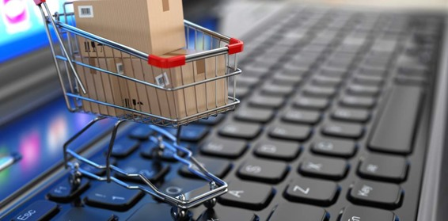
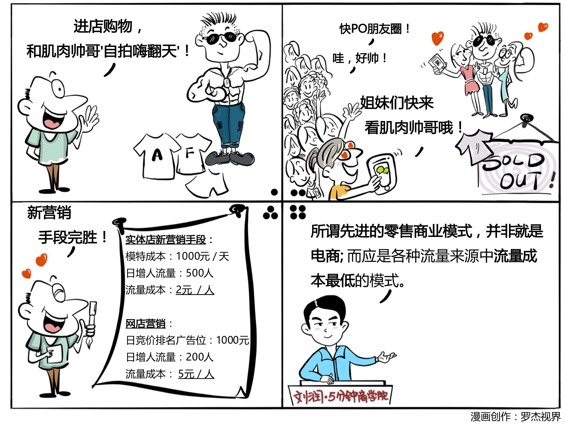

# 006｜比电商更先进的零售方式是……

今天是《5分钟商学院》学习的第二周，本周，我们将专注一个主题：

> 商业世界的五大基础逻辑。

> 概念：流量成本

零售的基本逻辑，是流量成本。

流量成本指的是我们每获得一个客户，要为此付出去的基本价格。

如果把你的销售过程比喻成一条河床的话，那么这个流量，就是从不同渠道、不断流入河床的那个水源。你的河床设计的再科学再完美，但是只要没有水源，一切商业模式都是摆设。

> 案例

比如，你是一个磨刀老头，你一整天走街串巷，一共遇到了10个人把你拦下来。假如说你去做快递，一天的快递工资是500块，就等于你放弃了500块的机会成本。我们拿这个成本，除以一天所能遇到的潜在客户数10个人，获得一个潜在客户的流量成本就是50元。

换一种商业模式，开个卖鞋子的店，这个店的流量成本，该怎么来计算呢？就拿他一个月的租金，比如说10万，除以他这一个月预计有可能到店的人流，比如说5000个人，那么获得每一个潜在客户的流量成本就是20元。

> 运用：如何获取低成本的流量？

在这个与用户交互方式日新月异的时代，流量来源再也不是开一家店而已，也绝不是把线下的店搬到网上那么容易，你有很多方式：比如说社群，比如说自媒体电商，比如说通过直播来销售，比如说通过口碑获得更多新客户，比如说通过和老客户的互动产生重复购买，比如说到3456线城市租金低的地方去开店。

> 如何选择？

用流量的逻辑来统一所有的零售方式，并且懂得计算每一种流量来源的流量成本，将是所有企业的基本功。  

> 小结：最优选择

什么是流量？就是进入你的销售漏斗的潜在客户的数量。

什么是流量成本？就是在每一个渠道，获得一个潜在客户的平均价格是多少。

什么是先进的零售商业模式？就是你做完一大堆的计算之后，找到了一种最便宜的方式，从流量的大河中间取水灌溉。

* * *

期待你的进步，五分钟商学院的第六天。

拿出一张纸，一支笔，写下你经营的产品的所有流量来源，并试着计算每一种来源的“流量成本”。

> _因为你刚好遇见我，留下足迹多美丽_。