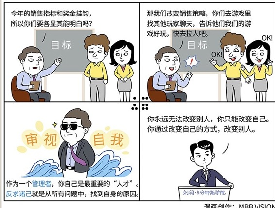

# 069｜发而不中，行有不得，反求诸己

### 概念：反求诸己

反求诸己，就是从所有的问题中，找到自身的原因。管理里面从来没有“你应该怎么样”，更没有“他应该怎么样”，只有“我应该怎么样”。从来没有什么叫“这一届员工不行”，只有自己不行。如果真的是员工不行，你没有把不行的员工换掉，也是你自己不行。

### 案例

> 孟子曰：“爱人不亲，反其仁；治人不治，反其智；礼人不答，反其敬 —— 行有不得者，皆反求诸己。”意思是说，别人做不好，一定要反问自己，是否管理有问题。

> 化繁为简的能力，是组织的能力，是管理者的能力，不是工程师的能力。怎样才是好的管理？我们来看看盖房子。你找20个工人来，说，这是图纸，这是钱。你们必须有化繁为简的能力，把房子在20天内盖好。这是不现实的。作为管理者，我们懂得如何化繁为简。我们要先把工种先分为木工、水电工、瓦工等等。再把工序分为一二三四五。然后，重要的部分来了，你要给每个工人下达一个“简单”的指令，比如把砖头直直地砌起来，3米高、2米宽。就这样。

工程师只应接受简单的指令。我们“期望”大家足够聪明，但如果把质量“依赖于”大家的聪明，就会把公司置于巨大的风险之上了。

对人才期望过高，对现有能力和主动性不满，可能是因为管理的薄弱。我们要懂得“反求诸己”。

### 运用：两个传闻故事

故事1：

> 周鸿祎早期是做3721，卖中文域名的。这玩意难卖，看不见、摸不着。开发出这玩意，招一个销售总监，给他定指标是最容易做的事情，这似乎就叫：管理。但是，有用吗？如果你自己都不知道这东西卖给谁、怎么卖，当初为什么要开发它呢？

> 周鸿祎制订了一个“农村包围城市”的策略。他找到一群销售人员，给他们几个简单的指引：1）到二线城市去，2）引：中文域名就是网上门牌号码，3）诱：你不买，别人可能就买了。据说就靠这样简单的销售策略，3721中文域名销售战绩颇丰。

这样的销售策略，你需要每一个销售人员都是销售大师吗？不需要。

故事2：

> 另一个故事有关史玉柱的《征途》。这是一款新游戏，怎么卖？当时网络游戏是盛大《传奇》的天下。标准“管理”的做法是：找一群销售，给销售定指标，和奖金挂钩，然后让销售各显其能。有用吗？

> 传闻史玉柱制订了一项“策反”的销售策略。他找到一批人，每天去玩《传奇》。他们的任务很简单：1）找到其他玩家，2）聊天，3）说：《征途》挺好玩的，去玩吧。

这样的销售策略，你需要每一个销售人员都是销售大师吗？不需要。

这两个故事都未经验证。但听闻后，深感这两个“策略”的简单、高明。

### 小结：认识反求诸己

你永远无法改变别人，你只能改变你自己。你通过改变自己的方式，改变别人。我们会用三周，来教大家如何：从员工到经理，从经理到总监，从总监到CEO，不断提升，反求诸己。