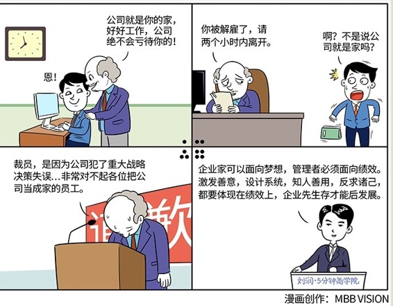

# 070｜梦想归梦想，绩效归绩效

### 概念：面向业绩

> 绩效，就是达成公司的经营目标。

管理，也许从来就不曾性感过。要理解这件事，就要理解公司里的两层关系。

公司里的第一层关系，是以董事会为代表的所有的股东，和以CEO为代表的管理层之间的关系。这一层关系，就是所谓的“委托-代理”关系。CEO，就是首席执行官，只是管理层的最高代表，负责执行董事会对绩效的要求。这一层的关系，叫：治理。

另一层关系，是以CEO为代表的管理层，和员工之间的关系。管理层和员工之间的关系交错复杂，层层汇报，互相包含，很难区隔。如果你一定要划一道界限，能参与CEO月度会议的那一层，叫管理层，或者叫核心管理层。管理层和员工之间的关系，叫：管理。

> 董事会负责把公司的愿景，改变世界的梦想，翻译成经营的绩效目标，管理层负责达成这个目标。梦想的归梦想，绩效的归绩效。管理层，或者说，本质是执行层，最重要的工作，就是使命必达，对绩效负责。

### 案例

2004年，中国某著名IT公司大规模裁员。这家公司一直鼓励大家把公司当成家，但突然有一天决定不要你了，请你两个小时内离开。一位伤透了心的员工写了篇文章：《公司不是家》，在网上被疯狂转载，让很多人都心有戚戚。

西南航空的坚持不裁员，和这家IT公司连“家人”都裁掉，哪一个，才是正确的管理决定？

为了绩效，这家IT公司认为，必须立即止血，否则连长期长什么样都看不见了。

后来，那家IT公司的董事长出面道歉：裁员，是因为公司犯了重大战略决策失误。但同时，这家公司也开始在“亲情文化”中，加入“绩效文化”。这家公司后来发展得不错。30年庆的时候，写《公司不是家》的这位员工，给董事长写信，说自己买了房买了车，感谢公司。

### 运用：对绩效负责要懂得平衡三件事

第一，功劳与苦劳。我们常听说，“我虽然没有功劳，但是我也有苦劳。”大部分人，可能只关注自己的付出，但并不关心付出的效果。但作为管理者，我们要清楚，我们应该为苦劳鼓掌，但是为功劳付钱。

第二，梦想与现实。活着，是目的还是手段？当活着不是问题的时候，活着是手段，意义才是目的。可是，当活着都成问题的时候，活着，就是目的本身。企业也一样。赚钱，是目的还是手段？当赚钱不是问题的时候，赚钱是手段，梦想才是目的。可是，当赚钱都成问题的时候，赚钱，就是目的本身。

第三，理论与实践。每过一段时间，管理界就会流行一些新鲜有趣的管理理论，很多人像追星一样追逐这些理论，甚至像研究“一根针尖上可以站几个天使”一样，钻到牛角尖里。德鲁克说，管理首先是实践。有用的，就是好的。新的、漂亮的不一定就好。

### 小结：为什么要面向业绩？

企业家可以面向梦想，管理者必须面向绩效。激发善意、设计系统、知人善用、反求诸己，最终都要体现在绩效上，企业才能先生存，后发展。为了绩效，我们要平衡功劳与苦劳，梦想与现实，理论与实践。