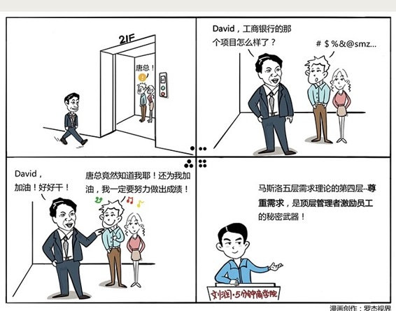

# 071｜激励就是发现需求，满足需求

讲完管理的五大基础逻辑后，本周，我们详细地聊一聊，如何激发善意，拿什么，来激励管理系统中这个最特殊的要素，“人”的主动性。

### 概念：马斯洛需求理论

马斯洛需求理论，是由美国著名的心理学家亚伯拉罕·马斯洛提出的，在他看来，人有两类需求，一类是生物属性带给我们的低级需求，比如延续生命；一类是进化后逐渐显现的高级需求，比如释放潜能。

> 低级需求不断减弱，高级需求不断增强，两种趋势叠加，马斯洛提出了著名的“五层次需求理论”：第一，生理需求：首先，要活着；第二，安全需求：活着不够，不能担惊受怕；第三，社会需求：安全后，融入集体，求归属感；第四，尊重需求：不仅接受我，还要尊重我；第五，自我实现需求：让我的潜能，完全释放。

#### 案例

据媒体报道，2016年比尔·盖茨的财富，已经达到900亿美元。这是什么概念？假如他老人家能活100岁，并且必须在死前把所有财富花完，那么从现在起，他必须每天花掉600万美元，相当于4300万人民币，全年无休。

我们在商业篇，第22课讲过“边际效用”。当钱如空气、阳光和水一样，几乎是无限供给的时候，钱对他的边际效用，就降为零了。这时候，一定有种钱之外的需求，继续激励着他，甚至更加努力的工作。

### 这种能激励全球首富的需求，到底是什么？

运用：管理学界的激励

第一，生理需求。员工首先要生存。对吃顿火锅都要等到过节的员工，激励没什么花把势：给钱。在这个需求级别的员工，你和他谈梦想会被抵触：别和我谈梦想，我的梦想，就是不用大清早去超市排队，买打折鸡蛋。增加工资、改善劳动条件、给更多假期，就是最好的激励。

第二，安全需求。员工如果总提心吊胆，自己的工作会不会明天就没了，那么公司的愿景、使命、价值观，和他没有半毛钱关系。他只会想：千万不能生病，不能生病，不然立刻卷铺盖走人。各种福利、保险、严格执行的规章制度，是对提心吊胆的员工，最好的激励。

第三，社会需求。别发旅行津贴，组织大家一起去旅行；别发儿童节礼券，组织员工办亲子活动；别发健身补贴，鼓励员工每天锻炼，然后举行运动会。这些都是很有效的友爱激励、归属感激励的手段。把社会需求发成购物券，是用第一层的激励，满足第三层的需求。

第四、尊重需求。这一层，是顶级管理者的秘密武器。

据说，有次前微软中国总裁唐骏走进电梯，里面有一位差了好几个级别的底层销售，和他女朋友。唐骏问：David，工行那个项目进展怎样了？David一惊，然后语无伦次地回答了几句。电梯到了，唐骏拍了拍他肩膀：好好干，David，加油。这个David完全没想到，唐骏居然知道他的名字，他正在做的事，而且在他女朋友面前，这么给面子。从此，他被彻底收服了。

有一次，我向唐骏当面求证这个故事。他说，当他还是个小经理时，有次微软全球CEO Steve Ballmer从他身边路过，问了句：Jun, how do you do？唐骏说，你知道吗？我当时骨头都酥了。从此，他强制自己记住每个员工的名字、学校、职位等等。

松下幸之助有次吃饭，说：把主厨叫出来。大家很紧张。松下幸之助说：你的牛排很好吃，但我今天只能吃下一半。我想亲自向你解释，以免餐具收到厨房，你会觉得沮丧。

第五，自我实现需求。对处于这样阶段的人，别说：我有个赚钱的好点子，要不要一起来？你要说：你是想卖一辈子糖水，还是想和我一起改变世界？回到比尔·盖茨身上来，唯一能激励他的，可能就是自我实现，比如解决一下第三世界国家的贫困问题，或者攻克一下艾滋病等等。

### 小结：发现需求，满足需求

用“发现需求，满足需求”的方式激励员工，需要注意：

一，这五个需求并不依次出现，他们同时存在，只是不同阶段的迫切性、强烈程度不同；

二、找准阶段是关键，用自我实现的手段，激励生理需求阶段员工，他会觉得你2；用生理需求的手段，激励自我实现阶段的员工，他会觉得你Low。