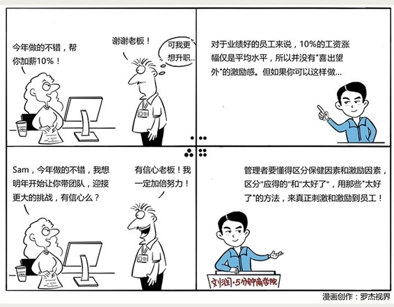

# 072｜从“应得的”到“太好了”

### 概念：双因素理论

美国心理学家赫茨伯格把一个人认为自己“应得的”那些东西，叫做“保健因素”。而如果你给一个人一样东西，他喜出望外，说“太好了”，那这东西，就叫做“激励因素”。

> 赫兹伯格在1959年提出了著名的“双因素理论”：人不会因为得到“保健因素”而满意，只会因为得不到而不满；相反，没有“激励因素”没关系，但如果有了，会备受激励。

### 案例

每年中秋都发月饼，发起来很麻烦，员工又不爱吃。我们在第33课“商品证券化”里讲过，有些公司后来选择发月饼券。但还是麻烦。既然都不吃，你想，那咱以后，就不发了吧？

没想到，你一说不发，公司每一个人都反对，情绪很大。你很困惑：你们都说没用、不吃、浪费，我一说不发，你们的反应，怎么就这么大呢？

是第4课讲的“损失规避”的心理在作祟吗？有一部分。但更重要的原因是，员工把“中秋节月饼”这项福利，当成是自己“应得的”。什么是“应得的”？就是你给我，我不会感激；你不给我，我骂死你。

### 运用：如何利用这个理论，激励我的员工呢

首先，你要懂得区分保健因素和激励因素，区分哪些是“应得的”，哪些是“太好了”。

保健因素，通常包括环境、福利、公平，和工资等等。工资为什么是保健因素？因为在员工心里，那是“应得的”。

激励因素，通常是工作带来的表现机会、喜悦和成就感。

除了这些，对应工资，奖金是一个重要的激励因素。因为良好的工作成绩而得到奖金，会让员工非常喜悦。所以，工资和奖金的搭配，是最基本的双因素激励手段。

### 第二，多研究激励因素，研究人性。

保健因素需要被满足，但真正激励员工的，是激励因素。怎么做？关键是让员工有种“太好了”的感觉。第17课讲的“适应性偏见”心理，又可以发挥作用了。

插一句，你有没有发现，很多管理方法，都是心理学家提出来的？作为管理者，我们必须要对人的心理，或者说“人性”这个东西，多琢磨，多研究。

在适应性偏见中，我们讲过“意外幸福感”，就是用“偶然和不可预测的激励”，让员工觉得“太好了”。

### 第三、防止激励因素，变为保健因素。

因为适应性偏见的存在，激励因素用多了，就会变成保健因素。管理者要懂得用“对比幸福感”来规避。

### 小结：认识双因素理论

人不会因为得到“应得的”“保健因素”而满意，只会因为得不到而不满；相反，没有“激励因素”没关系，但如果有了，则会因为“太好了”，而备受激励。

基于赫兹伯格的双因素理论，后来东京理工大学教授狩野纪昭提出了著名的Kano满意度模型。他说，对用户也是同理。比如我，从未因酒店提供清洁的床单而感激，但有次我在房间桌上，看到一本翻开的金融时报，是对我的访谈，因此我意外惊喜。