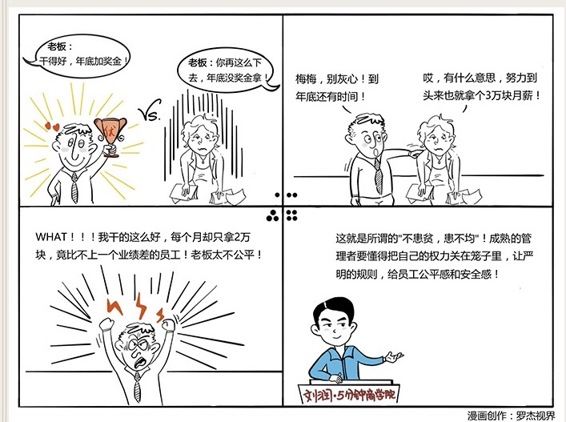

# 075｜工资是否应该透明？

### 概念：公平理论

美国心理学家约翰·亚当斯在1965年提出了著名的公平理论：员工的激励程度来源于对自己和参照对象的报酬和投入的比例的主观比较感觉。

> 员工会拿自己的薪水和三个东西作比较：内部的其他同事，外部的市场行情，和自己的努力应得。如果有一个不公平，员工就会产生巨大的负面情绪。

### 案例

> 李雷去年进入一家知名外企，月薪2万，干得好，有奖金。这一年，他尽心尽力，加班加点，业绩非常好。公司表扬他，同事佩服他，主管赏识他。年终考核，加薪20%。李雷特别高兴，觉得受到了嘉奖和重用。

> 他的同学韩梅梅和他在同一个部门，业绩却不行，还总是被老板骂。李雷总安慰她。韩梅梅叹气说：哎，你都成明星员工了，我呢？干来干去都是3万一个月，真不公平 ……

> 李雷听到这里，突然怔住了，仿佛一把尖刀刺在心脏上。凭什么啊！我们干一样的活，她干得远不如我好，居然拿3万，我这么辛苦，加完薪水，才2万多 …… 很快李雷就离开了公司。

### 运用：薪酬的三个“公平”

第一，内部公平。

公司从创业期走到成熟期，管理者开始无法判断每个人的能力和贡献时，就是尽快建立专业的薪酬福利体系的时候了，把工资和责任对应起来，把奖金和绩效对应起来，把股权和潜力对应起来，摆脱拍脑袋。

公平不代表大锅饭，相反，基于绩效的薪酬差距越明显，激励作用就越明显。但是，这个差距必须基于绩效规则。当管理者发现，自己在激励上，只有制定规则的责任，没有分配奖励的权力时，就离公平不远了。

第二、外部公平。

外部公平，指的是员工的薪水，也要和行业标准相匹配，否则很难招到人才，招到也很容易流失。

同时解决内、外部公平，并不容易。

某公司急剧扩张，需要大量人才，于是决定用高工资招聘新员工，但是，老员工不变。公司迅速从市场上抢来了一批新员工，可是很快，老员工就都知道了。这种不公平的“待遇倒挂”，伤了不少老员工的心，于是纷纷跳槽到竞争对手公司。

然后，公司换了个总经理，他立刻做出调整，宣布所有新员工全部降薪，和老员工统一薪酬标准。这又伤了新员工的心，他们也纷纷愤然跳槽到竞争对手公司。

第三，个人公平。

所谓个人公平，就是：做我该做的，拿我应拿的。但这是个非常主观的问题。曾有位90后创业者说，他让员工自己开工资。你千万别随便学。先做个调查，问每个员工你应得多少。你会发现这个数字加一起，可能是公司利润的好几倍。

所以，要保证个人公平，最重要的是规则清晰，赏罚分明，把自己的权力，锁在笼子里。

### 小结：认识公平理论

公平理论认为，员工不仅关注薪酬，同时关注的内部公平，外部公平，和个人公平。成熟的管理者要懂得把自己的权力关在笼子里，让严明的规则，给员工公平感和安全感。