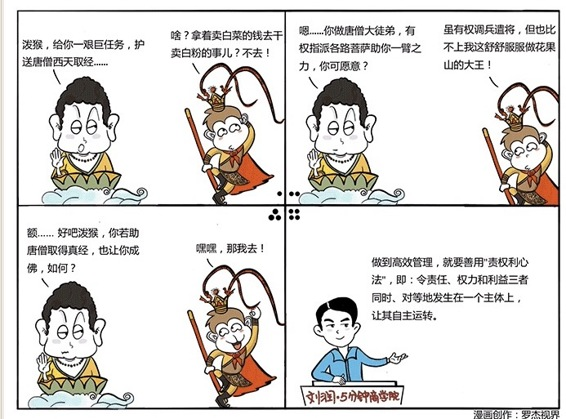

# 076｜老板做员工的事，员工讨论国家大事

### 概念：责权利心法

责权利心法，就是在任何一个管理单元上，责任、权力和利益，这3件事情必须要同时、对等的发生在一个主体身上。

### 案例

> 微软上海的办公室早期在美罗大厦，我们在19层有大概小半层是员工餐厅，员工每天可以在这里吃午饭和晚饭。

> 刚开始员工都很满意，但吃着吃着，很多人就觉得腻了，希望供应商能多换换口味。供应商当然许诺会改进，但效果却并不明显。

> 聪明的微软的行政部想到一个办法，微软餐厅同时提供午餐和晚餐，因为中午吃饭的人会多一些，所以赚的钱更多。

于是行政部决定：

第一，选两家餐饮供应商，一家提供午饭，另一家提供晚饭；

第二，每3个月，做员工满意度调查：你喜欢午饭，还是晚饭？

第三，如果喜欢晚饭的多，午饭、晚饭供应商交换；如果喜欢午饭的多，供应商不变；

第四，连续6个月，2次调查，午饭都胜出的话，换新供应商做晚饭。

> 自从这个制度开始实施后，那些说自己已经做得很好了、尽了最大的努力的供应商，开始提供比原来好得多得多的服务。

微软行政部，就是通过一个制度，把供应商的责任，和他可以获得的利益给绑定起来了。

### 运用：责权利不等会发生什么？

第一，权力独大，将会导致权力寻租。

比如某交通局长手上掌握数十亿资金的审批权。这就是权。可是这项工作做好了，也不会给他100万奖金；干坏了呢，也不会惩罚他50万。正向和负向的激励都不明晰，责利不清，权过大，那舞弊的冲动就会相当大。我们痛恨贪腐，但贪腐，其实就是权大而责小的一个几乎必然的结果。把我们放在那个位置上，也未必能独善其身。

> 法国管理学家亨利·法约尔，又把它称之为“法约尔原则”，就是：凡权力行使的地方，必有责任。

#### 第二，利益独大，就会引发内耗冲突。

很多公司以利诱人，以利驱人。员工的奖金、提成都特别诱人，但是有的时候，会忘了给相应的权利，甚至对应的责任，就会出现所谓的“肥缺”，这时候，上下级就会天天处于资源争夺战之中，引发冲突。

#### 第三，责任独大，一定催生消极怠工。

责任很大，但是权力很小，将会导致这件事儿我不可能做好啊；责任很大，但是利益很小，将会导致这件事做好了对我也没用啊。在这两种因素的共同作用下，消极怠工，就成了多数理性员工的最优选择。

> 我们经常听人说：体制问题。所谓的体制问题，就是在设计系统的时候，没有熟练使用责权利心法。大到CEO，小到前台，都要摆正这三者之间对等关系。

### 小结：认识责权利心法

请你从座位上站起来，走出你的办公室，随便找个人聊聊，看他是否真的是责权利同时加身。

如果“是的”，那你的公司是在自我运转的，恭喜你，你是一个高效管理者。

但如果“不是”，你就很可能发现，你公司里，总经理在做总监的事，总监在做经理的事，经理在做员工的事，而员工，都在讨论国家大事。