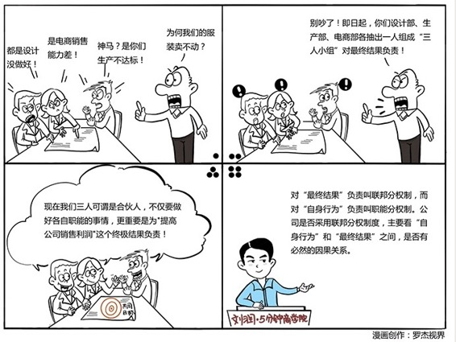

# 077｜考核结果，还是考核行为？

### 概念：分权机制

美国由50个州和1个特区组成，是典型的“联邦制”国家，它的中央政府叫做联邦政府，它的每个州实际上都是一个主权单位。在不违反宪法的前提下，每个州有独立的立法权、征税权。州政府，对整个州的居民是否安居乐业这个“最终结果”负责。

每个州政府之下有立法、行政和司法三个部门，三权分立。每个部门，对自己职能范围内的“自身行为”负责。

美国联邦政府和州政府的关系，是联邦分权；州政府和往下各职能部门的关系，是职能分权。

管理公司，其实和治理国家一样，选择是对“最终结果”负责呢，还是对“自身行为”负责，要看自身行为和最终结果之间的因果关系。

职能分权制的好处是：执行简单，容易专注，效率很高，但对管理要求高。

联邦分权制的好处是：考核简单，容易激励，主动性高，但对员工要求高。

### 案例

创立于2008年的著名的女装淘品牌“韩都衣舍”，因为业绩问题，从原来的“职能分权制”的设计部、生产部、电商部中，各抽出一人，组成“三人小组”，用“联邦分权制”让小组对“最终结果”负责。这样，三大职能部门，被拆分为280多个联邦。

因为对“最终结果”负责，所以这些小组被授权，自行决定款式、定价、促销方案，以及独立的财权，自行决定下单生产。

权力上的联邦制，利益上的合伙制，韩都衣舍的“小组制”，让团队真正承担起责任。“责权利”重新统一，为韩都衣舍的快速发展，做出巨大贡献。

### 运用：联邦分权还是职能分权？

第一，联邦分权制，和职能分权制，是两个基础模型，每个公司都一定是同时使用。就算你的公司是职能分权制，但是你的整个公司作为一个主体，是责权利同时加于一身的联邦。就算你的公司是联邦分权制，全是独立经营体，但每个最小单位的独立经营体内部，一定是职能分权制。

第二，把“联邦分权制”往下推行到哪一层，关键是看，你能不能找到“自身行为”和“最终结果”之间的因果关系，你希望你的团队，是对最终结果负责，还是对自身行为负责。

对于生产，相对容易从最终结果，倒推出自身行为，所以可以用职能分权的方式管理，比如微软的Windows，是1万多名工程师开发出来的，不断层层切分职能，最后由Build工程师，组装成系统。

对于销售，比较难证明，到底哪种自身行为，能产生良好的最终结果。所以，销售管理通常是联邦制。分地区、分行业，怎么做自己想办法，交足粮食就好。

### 小结：认识分权机制

对“最终结果”负责的制度，叫联邦分权制，对“自身行为”负责的制度，叫职能分权制。再复杂的系统设计，比如阿米巴，内部市场化，项目制，事业部制，矩阵式管理，小微企业等等，都是用这两块积木拼出来的管理大厦。选择用哪块积木，要看“自身行为”，和“最终结果”之间，有没有必然的因果关系。