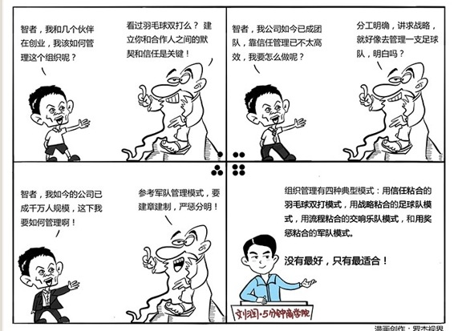

# 078｜羽毛球双打、足球队、交响乐队，还是军队？

### 概念：组织模式

> 基于“联邦分权制”，和“职能分权制”这两块基础积木，有几种典型的组织模型：羽毛球双打模式，足球队模式，交响乐队模式，和军队模式。

### 案例

我是某企业的高级商业顾问。我认识它创始人的时候，公司几十人，现在已近千人。创始人和高管们都感觉，今天的公司已远不如创业时那么有活力了，公司正在变成自己曾经痛恨的样子：组织越来越大，流程越来越多，考核越来越复杂，于是很想“回归创业”。

> 但这是不可能的。每个企业阶段，都有这个阶段的管法。

那家企业已经大几百人，无法形成几十人时才有的那种无间的信任。到了可能必须用“交响乐队模式”，或者“军队模式”管理企业的阶段，却怀念“羽毛球双打模式”，只会把公司管得越来越乱。

### 运用：四种模式的粘合剂

羽毛球双打模式：

如果你看过羽毛球双打比赛，就会发现，两位羽毛球选手之间没有非常明确的分工，比如你一定是前场，我一定是后场。这是典型的“联邦分权制”，考核两名选手的，是“最终结果”，赢得这场比赛，而不是“自身行为”，你接到多少球，我接到多少。所以，用来粘合这两块独立的积木，成为组织的是信任。

足球队模式：

足球比赛就要复杂得多了。你不能把11个训练有素、彼此信任的人往球场上一扔说：你们好好踢，赢了不会亏待大家的。这样，估计11个人都抢球去了。在足球队这样规模的组织中，就要动用“职能分权制”这块积木了。球场上必须有前锋、中场、后卫、守门员。每个人有明确分工，但也有很强自主性。所以，用来粘合分工明确、也很依赖自主性的11块“职能”积木的是战略。

交响乐队模式：

相对于足球队，交响乐队有着更加明确的分工。它有五大部门，弦乐组、木管组、铜管组、打击乐组和色彩乐器组。五大部门下，分设很多小部门。比如木管组，下设短笛、长笛、双簧管、英国管、单簧管、低音单簧管、大管、低音大管。短笛组，也由若干乐手组成。加一起，估计几十人上百人。这样的组织，是典型的“职能分权制”，而且甚至无法像足球队一样，给予职能基于战略的自主性。所以，用来粘合交响乐队中层层分工的“职能”积木的是流程。

军队模式：

军队中，军师旅团营连排班，是更严格的“职能分权制”。士兵心中对战争的意义也许充满神圣感，但对战略全局，可能并不了解。大家只需要关心职能内的“自身行为”指标，不用关心“最终结果”。

比如，秦国士兵的“行为指标”就是敌军人头。砍下一个人头，晋爵一级，土地一顷，宅地九亩，农奴一人。类似于“计件工资”。但是相反，如果你在战场上叛逃，叛逃者五马分尸，五人小组中另外四人也连坐。

所以，用来粘合军队中无数细小的“职能”积木的是奖惩。

### 小结：认识组织模式

组织模式，就是把联邦分权制，和职能分权制的积木，粘合在一起的方式。因粘合剂的不同，就有四种典型模式：用信任粘合的羽毛球双打模式、用战略粘合的足球队模式、用流程粘合的交响乐队模式，和用奖惩粘合的军队模式。没有最好，只有最适合。