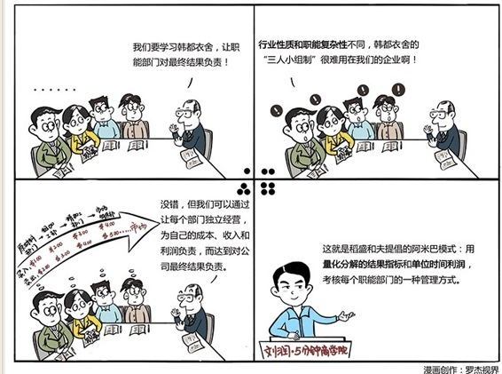

# 079｜内部市场化的组织模式

### 概念：阿米巴模式

> 阿米巴模式，是指将大的组织分为小的独立经营体，通过与市场直接联系的独立核算制进行运营，从而实现“全员参与”的经营模式。阿米巴模式的本质是“量化分权”，或者叫“内部市场化”。

稻盛和夫发明了阿米巴模式后，在京瓷中推行，据说使得京瓷历经4次经济危机而屹立不倒，成为全球企业界的神话，也使他位列日本经营四圣。

### 案例

把联邦制的考核优势，和职能制的分工优势相结合，用公司利润考核每一个职能部门。

陶瓷有混和、成型、烧结、精加工四个职能。假如作为原料的泥土成本是1元，进过混合部门加工后，用2元的价格，把半成品卖给成型部门。成型部门把混合土塑造成型，再用3元的价格，卖给烧结部门。接着，烧结部门用4元的价格卖给精加工部门，精加工部门最后把成品陶瓷，用5元的价格卖向市场。

所以，从泥土到陶瓷，每个职能部门有自己的成本、收入和利润，都是一个责权利完全独立的经营体，对结果负责。

> 稻盛和夫把这种通过职能分工量化计算成成本、收入、利润，从而虚拟出来的独立经营体，叫做：阿米巴模式。

### 运用：设计阿米巴系统要注意几点

第一，“内部定价”的管理体系。

回到京瓷身上，成型部门会想，造型是最重要的，凭什么我成本2元、收入3元？我至少定价4元。烧结部门立刻反对，你想多了，我最多2元购买。所以要实施阿米巴模式，就必须有个类似于国家发改委价格司的机构，尽量公允地给每个部门的服务定价。这其实极其困难，也是为什么很多西方管理学者痛批阿米巴，说是计划经济时代的伪科学。

第二，“单位时间”的核算制度。

每个职能部门都有了成本、收入、利润的概念后，要懂得把利润平摊到总工作时间上，计算每人每小时创造的部门利润，并把这个“单位时间利润”，作为核算指标。这其实就是用某种方式的“人均利润”。

第三，“哲学共有”的奖励制度。

按照西方管理理论，花大力气计算出单位时间利润后，应该把这个指标，和员工的奖金挂钩了吧？稻盛和夫说这不行，这会助长员工的“利己之心”，然后阿米巴都去争抢资源。他说，阿米巴都要有“利他之心”，关注“哲学共有”的公司的整体效益。员工收益，和公司整体收益，而不完全是阿米巴的绩效挂钩，才不会闹出全公司在亏损，而有的阿米巴却拿到利润奖的笑话。

### 小结：认识阿米巴模式

稻盛和夫的阿米巴模式，是用量化分解的结果指标，单位时间利润，考核每个职能部门的一种管理方式。

推行阿米巴模式有三个核心，第一，尽量公允的内部定价体系，用以计算每个职能部门的成本、收入、利润。第二，基于职能部门利润，和总工作时间，计算出来的“单位时间利润”，作为核算制度。第三，基于“哲学共有”思想下的，精神和物质并重的奖励制度。这三点，也被很多人称为：分、算、奖。