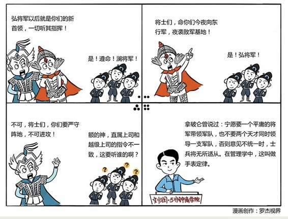

# 080｜一个员工，不能有两个老板

概念：手表定律

> 手表定律，就是你戴一块手表时，一看，就知道时间了。但如果你戴两块，不但不能更准确地判断时间，反而制造混乱。

手表定律，是设计系统时的一个大忌。无数人用血泪教训警示世人，但无数人依然飞蛾补火。

拿破仑曾说过：宁愿要一个平庸的将军带领一支军队，也不要两个天才同时领导一支军队。佛教《百喻经》中也有这样一个类似的故事：一条两头蛇，左头要向左游，右头要向右游，无法行走，结果掉落油锅中烫死了。

### 案例

某公司部门高管离职，于是挖了很有口碑的职业经理人韩梅梅，接替他的位置。但公司CEO又担心韩梅梅不了解公司情况，于是派亲信李雷作为部门的“联席总经理”，辅助韩梅梅。这种制度，有个专业的名词：双首长制，英文叫：two-in-one-box。

但CEO万万没想到，李雷和韩梅梅不但没有合作无间，反而产生了很多冲突。比如有员工投诉，李雷安排了很多工作给他，韩梅梅也安排很多，都说自己的是最重要的。甚至连请假，现在都不知道向谁请。员工的士气和业绩，都出现下滑。

### 运用：设计组织的两个原则

第一、一个上级原则。

我有个微软老友，现在做投资，是中国最著名的天使投资人之一了。有次我问他，“成功经验”就不说了，你分享分享你的“失败教训”吧。

他想了想，说：股权平均的公司，我再也不会投了。

什么叫股权平均？兄弟俩一个做技术，一个做市场，一商量创业了。股份怎么分？一人一半吧。然后，噩梦开始了。创业中，太多无法证明对错的决定，从A这条路走，可以，B也行。但两位创始人都觉得对方的选择是死路。吵得不可开交，反而止步不前，最后“掉落油锅中烫死了”。创业中，一定要有绝对控制人。就算夫妻创业，也要确定谁是绝对领导地位。

最容易违反“一个上级原则”的场景，是越级指挥。CEO越级找到基层人员说：我很看好你，用业余时间来帮我做点事吧？员工或有兴趣，或莫敢不从。这其实就是给员工带了两块手表，他和他的直属经理，都会非常痛苦。

### 第二，一致管理原则。

员工不仅接受上级管理，还接受绩效指标，以及流程规范管理。所以，绩效指标不能冲突，流程执行必须平等。

绩效指标不能冲突指的是，员工帮公司赚到了100万，你给了他5万元奖金，那员工B做到100万，你也必须给。不能因为你觉得大家努力程度不同，就随意增减，否则员工就会无所适从。

流程执行必须平等指的是，某位员工加班到晚上12点，第二天早上迟到了，你罚不罚他呢？当然可以不罚。但是，如果有另一个同学也是加班到12点，第二天也迟到了，你也不能罚。制度面前人人平等，才能让员工对公司的流程制度，充满敬畏。

### 小结：认识手表定律

手表定律指的是，一只手表可以看时间，两只手表，反而会造成混乱的现象。

在管理上，具体执行时要注意两点：

第一，一个上级原则。这是设计组织系统的一个铁律：一个领导，可以有很多下属，但是一个员工，只能有一个领导。

第二，一致管理原则。绩效指标不能冲突，流程执行必须平等。