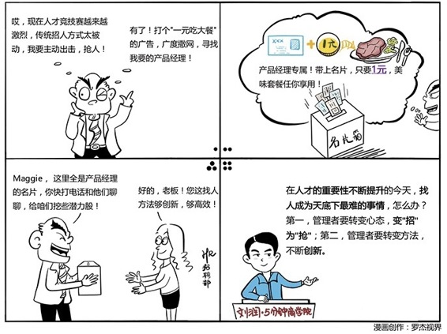

# 081｜找人，是天底下最难的事情

### 概念：变招为抢

在第32课“合伙人制度”里讲过，资本和人才，是两个永不停止的博弈。今天，人才的重要性明显上升。对应到管理的角度看，我们“选人”的逻辑，也必须从“招人”心态，变为“求人”，甚至“抢人”。

### 案例

雷军在2010年创立小米时，已经非常有名了，但在“招人”这件事上，一样遇到了很大的困难：他总是被质疑，这事靠谱吗？所以，在最初的半年，雷军恨不得每天挤出150%的时间来招人。他曾经在一周内有5天、每天超10小时说服一位跨国公司高管加入小米，但到最后对方还是拒绝了。他也曾为了说服一位资深硬件工程师加入，让几个合伙人轮流上，终于用12个小时说服了对方：“好吧，我已经体力不支了，还是答应你们算了！”

> 所以，雷军说：找人，是天底下最难的事情。

一个CEO，在企业的成熟期，其实是个COO，中间那个O是Operation，主要负责运营。在企业的转型期，其实是个CSO，中间那个S是Strategy，主要负责战略。在企业的创业期，其实是个CHO，中间那个H是Human Resource，主要负责人才。

### 运用：如何重视招人并发现合适的人才？

第一、从招人，到抢人。

2015年3月，雅虎宣布关闭北京全球研发中心，350人即将被裁。消息一出，无数互联网公司蜂拥而至，上演了“双十一”一般抢人的戏码。雅虎建立了一个招聘群，二维码公布的2小时内，涌入了300多家互联网公司和猎头。有些公司派人在雅虎的楼下蹲守，另一些公司则在大厦附近“游击式”推广，甚至有人追到地库抢人。有人1分钟内收到10余家公司的邀请，还有员工一天内增长400位微信好友，都是求推荐工程师。

### 第二、使用创新的方法。

著名的营销人小马宋在暴风影音时，公司急缺产品经理，所以请他设计一个招聘广告。他想，这么久都没找到合适的产品经理，再做一个广告，就能找到吗？于是，他和西少爷肉夹馍联合，在所有连锁餐厅推出产品经理套餐，拿产品经理的名片，就可以1元吃个产品经理套餐。结果收集了大量产品经理的名片，然后让HR去打电话了。

熊节在Thoughtworks组建成都分公司团队时，也发愁招聘的问题。于是，他花了几个晚上写程序，抓取豆瓣上读过他认为的那些好书的人。然后不断递归，再抓取这些人还读过什么其他书，抓了几万人后再分析，最后筛选出几十个技术大牛，然后让HR一个个去联系了。

摇摇租车创立时，公司缺人，早期员工张涛想去大公司挖人。两种人比较好挖：一种是钱少了的，另一种是受委屈的。于是张涛手写了一块招聘广告牌，像机场接人那样，天天站在某互联网公司门口。不少受委屈的员工看见了广告牌，纷纷上前和他聊天诉苦。就这样，他挖来了几个核心员工，完成了早期团队组建。

### 小结：认识变招为抢

随着时代发展，资本和人才的重要性，正在剧烈地向人才倾斜。用资本，像购买生产资料一样地去“招人”，变得越来越困难。

怎么办？第一，管理者要转变心态，变招为抢；第二，管理者要转变方法，不断创新。