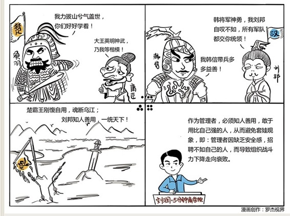

# 082｜武大郎开店，一个比一个矮

### 概念：套娃现象

著名广告公司奥美的创始人大卫·奥格威是个很有个性的人。据说，有次开董事会的时候，他给每位与会者送了一套他从俄罗斯带回来的玩具：套娃。套娃是俄罗斯的一种独具特色的纪念品，一个大的空心木娃娃，打开后，里面还套着一个小的空心木娃娃，再打开，里面还有一个更小的，一层层套下去，通常能有5～7个。

> 董事会成员们打开套娃到最后一层，里面有一张字条：你要是永远都只任用比自己水平差的人，那么我们的公司就会沦为侏儒；你要是敢于启用比自己水平高的人，我们就会成长为巨人！

这个故事如此之有名，以至于管理学界从此有了一个奥格威法则：善用比我们自己更优秀的人。奥格威法则所描述的这种现象，又被称为“套娃现象”。

#### 原因：

第一，是因为不安全感。

在一个金字塔式的组织里，晋升是最重要的获得名利的方式。如果招了一个比自己更优秀的人，管理者嘴上不说，但心里通常会有一种担忧：这个人会不会有一天取代我。很多管理者的安全感都建立在“我必须是整个部门最优秀的”这个基础之上。这就导致从选人阶段开始，管理者会阻止更优秀员工的加入。越平庸的管理者，越是如此，这就是所谓：兵熊熊一个，将熊熊一窝。

第二，是因为容易沟通。

因为下属不如你，所以他总是赞同你、敬佩你、坚定地执行你的决定，以至于你的感觉越来越好，慢慢开始把对下属的掌控力，误解为团队的执行力，并享受这种观点的统一性，行动的一致性。然后，很高效率地、做很低效果的事。

#### 运用：解决“套娃现象”的三个建议

第一，解决安全感问题。

优秀管理者的安全感，来自更大的发展空间。不少机构很得意，说自己中高层变化低于5%。流动低，其实同时意味着机会少。正常的流动性，是一套筛选机制，给优秀员工以希望。安全感，更来自于自信。更多培训和独挡一面的机会，能给管理者自信，从而在心中容得下更优秀的下属。

第二，解决制度问题。

比如：1）直属经理的上级，要参与面试，做最终决策。如果公司不大，建议CEO参与每一位员工的面试，杜绝直属经理招人的套娃心态；2）设定选人标准，新进员工的能力，超过其团队的平均能力水平，才予以录用；3）直属经理连续两次选人失误，新进员工都在垫底10%的水平，扣除直属经理一定金额的年度奖。

第三，解决自身问题。

作为CEO，你也要时刻反省自己，你自己是不是就是“套娃现象”中最外面、最大的那个套娃？

#### 小结：认识套娃现象

套娃现象，是一种因为不安全感，和追求容易沟通，而产生的一种管理者倾向于找不如自己的下属，从而导致组织一代不如一代，最后走向衰落的现象。从道德的角度来要求管理者是不够的，要从理性上解决管理者安全感的问题、监督机制的问题和CEO自身的问题，才能将套娃现象降到最少。