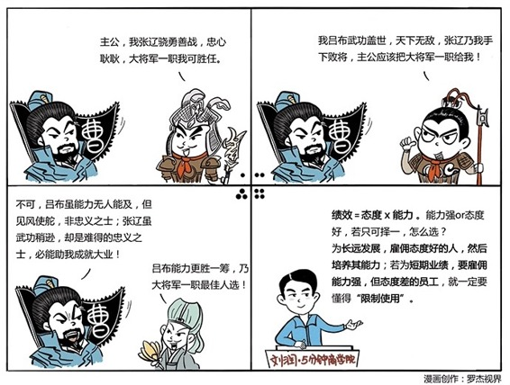
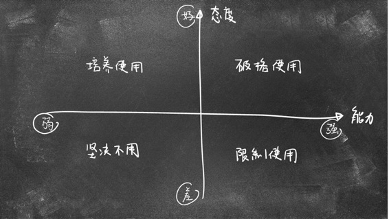

# 083｜鱼头美女身，美女头鱼身，你选哪一个？

### 概念：态度决定一切

> 态度，包括是否积极主动、富有责任心、愿意协作，这是养成的性格，简单来说，就是“想干”；能力，包括是否有做这件事的知识储备、是否有多年的经验、是否有相关的资源等，这是习得的技能，简单来说，就是“能干”。

想干的最高境界，是“自己灰飞烟灭都要干”，能干的最高境界是“把对手干到灰飞烟灭”。

选择：哪个更重要？

> 我们先看一个公式：态度 x 能力 = 绩效。也就是说，这两者缺一不可。如果只能选一个，你选态度，还是能力？

前美国西南航空的首席执行官赫伯·凯勒会选择：态度。他说：“我们能够通过培训来提升技能方面的水平，但是我们不能改变态度。”

也就是说，一个人的态度，比如他是否是个积极的人，甚至自带鸡血的人，是很难改变的。但是如果有很好的态度，比如刻苦、坚韧、自律、求知若渴，那么假以时日，能力还是有机会习得的。或者说，改变态度的难度，远远大于改变能力。

因为他的这句话，西方的企业界有句圣经一样的话：We hire for attitude, and train for skill.意思是：我们雇态度好的人，然后培养他们的能力。也有人因此说：态度决定一切。

### 运用：四个建议

第一、对于态度好，能力强的，破格使用。用，这没什么好说的。但是你更要看重这种人才的持续潜力，他有机会创造更大的价值。建议不要用“占便宜”的心态，低配录用，这样他早晚会走。建议给出超越他期待的破格条件，狠狠地留住这样的人才。

第二、对于态度差，能力弱的，坚决不用。有时候，各个部门实在缺人，你会有一种：只要你敢来，我就敢用的心态。然后心想，先忙过这段，可以再调整。但真招进来后，你就会发现，“再调整”，更令人心烦。你一拖再拖，公司因此乌烟瘴气，劣币开始驱逐良币，优秀人才逐渐愤然离开。招这样的人，就是饮鸩止渴。

第三，对于态度好，能力弱的，培养使用。这部分员工，是价值被低估的潜力股。你应该先感谢上天让你们相遇，然后不管有没有位置，先请他们上车，给他们充分的培训、实战的练习，施展的机会。他们有机会成长为公司真正的骨干。

第四、对于态度差，能力强的员工，限制使用。这部分员工，可能会成为你的噩梦。很多人说，我不是西南航空，我也不是谷歌，通常不是我选人才，是人才选择我，真的很难。我能不能把“噩梦”先招进来，然后驯化他呢？如果为了短期项目的利益一定要招，建议严格地限制使用。比如，不要放在核心的管理岗位上，有非常明确的考核指标，更多的监督机制等等。他有炸弹的威力，但开关却不在你手中。所以，你要准备好一个铅桶，以备不时之需。

### 小结：认识态度决定一切

我们知道，态度 x 能力 = 绩效。态度，也就是“自己灰飞烟灭都要干”；能力，也就是“把对手干到灰飞烟灭”。但这世界上没有完美的选择，美女的头，鱼的身体，或者鱼的头，美女的身体，如果必须只能有一个，你会选哪一个？

为了长远的发展，虽然很难，但西方主流企业界建议你：Hire for attitude, and train for skill.也就是，雇佣态度好的人，然后培养他们的能力。如果为了短期的业绩，必须要雇佣态度很差，但能力强的员工呢？一定要懂得“限制使用”。