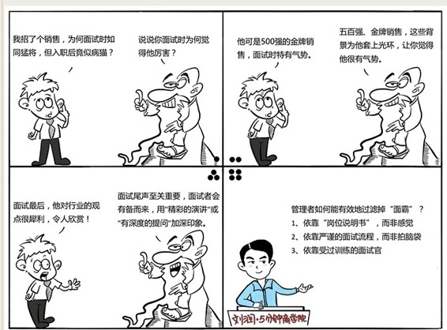

# 084｜面试的巨人，行动的矮人

### 概念：拒绝面霸

> 面试官的三个心理缺陷：首因效应、光环效应、近因效应。

首因效应，首因，就是我们常说的第一印象。人的心理有一个“缺陷”，就是首次接触一件事，或者一个人，留下的第一印象最为深刻，甚至很难改变。所以，为了留下“先入为主”的好印象，应聘者常常绞尽脑汁。他们会找最好的照相馆拍摄证件照、商务照，找专业人士打磨几十遍简历，把面试官可能问到的问题，用题海战术，面对镜子背诵千遍，训练出把背台词背出流露心声的感觉。相反，作为面试官，你的考验就是，避免第一感给你造成的心理倾向。

光环效应，是指对一个人的某种优点，或者缺点产生深刻、突出的印象后，这种优点或者缺点，会像月晕的光环一样被夸大。这是种常见的以偏概全的心理倾向。比如面试者“不经意”提到，他曾参加创业大赛拿到第一名。你眼中的他，立刻开始闪烁光环，创新、坚韧、吃苦、有领导力等等词汇拼命往他身上贴。你看到他的上一份工作在世界五百强公司，立刻觉得，他一定有着流利的英语、国际化视野、极高的职业素养等。所以，作为面试官，你的考验就是，避免“以貌取人”，或者是“以简历取人”。

近因效应就是，你花了一小时面试，最后礼貌地问：有什么我没问到，你想说的吗？他这时候想：总算让我等到了！然后，慷慨激昂地发表了一番对行业趋势的观点，对公司成就的赞美，以及对面试官的职业性的敬佩，深情并茂，甚至声泪俱下。你之前的判断，很可能被他最后5分钟的“演讲”改变了。因为，最近或最后的印象往往是最强烈的，可以冲淡在此之前产生的各种因素。同样，在多人面试的时候，如果几个人水平差不多，面试官会对最后一个人印象最深。聪明的应聘者，会在可能的情况之下，想尽办法让自己正好被排在最后一个。

光环效应，是由美国著名心理学家爱德华·桑戴克于上世纪20年代提出的。首因效应与近因效应，则是由另一位美国心理学家卢钦斯于上世纪50年代提出的。这两个人的理论，成就了很多的“面霸”。

### 案例：

你招了一个营销总监，A同志，曾在大外企工作过，面试的时候，你发现他长得气宇轩昂，穿得仪表堂堂，说起对营销的理解，和曾经做过的事情，那更是口吐莲花。你非常高兴地把他收入麾下，像得了个宝一样。但是没想到，他入职之后，业绩平平，工作被动，缺乏思路和执行力，还经常抱怨公司没给他施展的空间。

而相反，另一个候选人，B同志，相貌平平，也不怎么爱说话，入职后，兢兢业业，业绩非常突出，得到客户、同事，还有上司的交口称赞。

### 运用：给面试官的三个建议

第一，做好岗位说明书。

岗位说明书，就是这个岗位的职责是什么？比如需要开拓新市场。需要的能力是什么？比如拜访陌生客户的能力等。很多管理者不喜欢做这件事，觉得说不清楚。恰恰是因为这个“说不清”，让选人变得“看不准”。

第二，还是从制度的角度来解决。

比如增加面试次数。我在微软技术团队时，任何一个人进微软，要经过7轮面试，每轮独立给出是否录用的建议。就和打游戏一样，如果两个人写了“不录用”，你根本打不到BOSS。另外，也可以把岗位说明书里提到的，这个职位需要的10种能力，列出对应的准确的问题，减少面试官的随机发挥。

第三，做面试培训。

经过考核，才可以担任公司的面试官，提高面试的质量。

### 小结：认识拒绝面霸

选人最重要的环节之一，是面试。如何才能避免首因效应、光环效应、近因效应，过滤掉面试技巧100分，实际能力50分的“面霸”呢？

应该依靠“岗位说明书”，而不是自己的感觉；依靠严谨的面试流程，而不是领导拍脑袋；依靠受过训练的面试官，而不是貌似阅人无数的老板。