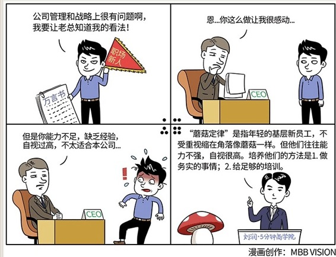

# 086｜谁跟我谈战略，我开除谁

概念：蘑菇定律

“蘑菇定律”这个词，来源于一批年轻的程序员，他们整天整夜的缩在办公室的一个角落里写程序，所以经常自嘲：像蘑菇一样的生活。

后来，蘑菇定律就特指，年轻的基层新员工，常被置于没人注意的角落，不受重视，甚至打杂、跑腿、受到苛责，就像蘑菇一样：在阴暗处静静生长，没人关注，甚至有时还要被浇上大粪。

但这是蘑菇生长一个必经的过程。员工也一样，这也是一个必经的过程，这个过程，甚至是新员工的一笔财富，训练能力、磨练态度。

案例：

网上盛传一个故事。说华为的一个刚入职的新员工，充满了激情，非常努力工作，而且，有一双观察入微的眼睛，一颗细腻分析的心。在工作中，他发现了很多华为在管理和战略上的问题，忧心忡忡。于是，他非常认真地、负责任地，给华为创始人任正非写了一封“万言书”，谈自己对华为经营战略的看法和建议。

任正非十分感动，然后，拒绝了他的建议，并且批复：“此人如果有精神病，建议送医院治疗，如果没病，建议辞退。”

马云也说过类似的话：刚进入公司三年的员工，不要谈战略，先把战术做好再考虑战略的问题，谁跟我谈战略，我开除谁。

为什么会这样？

这就涉及到对新员工，尤其是基层新员工，尤其、尤其是年轻的基层新员工，比如大学生的管理和培养问题。

这些员工处于一个特定阶段：第一，能力不足，经验缺乏；第二，充满激情，自视很高。俗称：眼高手低。但是，“眼高手低”在这里不是一个贬义词，他是几乎每一个人成长过程中的必经阶段。

在这个阶段的员工，暂时还不堪重用，只能做些简单、重复的事，但又因为只做这些简单、重复的事，他们的自信心甚至激情，都受到严重打击，觉得自己是天之骄子，但怀才不遇，金光被沙子掩埋了，像蘑菇一样没人管、没人问。有人也把这种状态，叫做：蘑菇定律。

运用：如何培养新员工

第一、做务实的事情。

对于年轻的新员工，应该给他们足够的关怀、温暖和鼓励，但要尽量从最简单、务实的事情做起，甚至比如贴发票、复印、装订商业计划书、写会议纪要等等，然后，对他们严格要求，促进成长。

第二、给足够的养分。

把新员工们扔在一个角落，是不够的，你必须给他们足够的养分，他们才能真正地成长。

很多外资企业在使用一种叫“管理培训生”的计划，来培养一些有潜力的“蘑菇”。这种方法有两个要点：选择合适的“小蘑菇”和有计划的轮岗培训。

什么叫“合适”的小蘑菇？每个公司标准不同，通常来说是，首先符合公司的价值观，正直、有激情等，然后做事主动积极、有事业心，再从能力上说，有快速学习的能力、分析问题的能力、表达能力等等。

选出小蘑菇，然后密集地安排1～2年的轮岗培训。最好的培训，是在职培训。在不同的部门里做最基层的工作，非常有助于他们综合能力的提升，也有助于公司选拔好蘑菇。2年后，有些“蘑菇”夭折了，但能活下来的，都是好蘑菇，可以摘下来，放在合适的岗位上。

现在，越来越多的国内企业，也开始把“管理培训生”作为培养蘑菇的方法。

小结：认识蘑菇定律

“蘑菇”是指，年轻的基层新员工，能力不强，自视很高。

培养他们的方法是，第一，做务实的事情；第二，给足够的培训。比如，管理培训生计划。