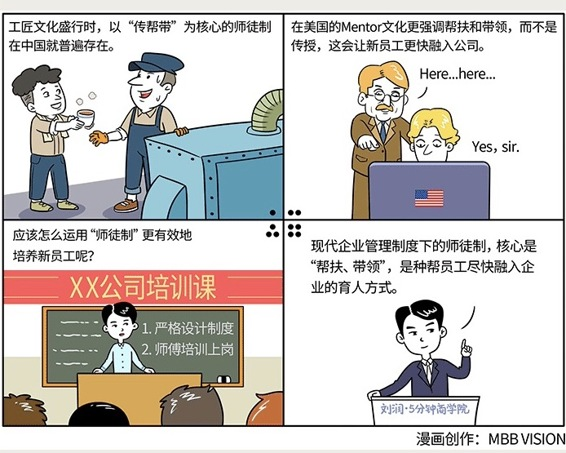

# 087｜有人敢欺负你，就报我的名字

### 概念：师徒制

师徒制，就是所谓的“传帮带”。

这个制度，其实在农耕时代，工匠文化盛行时，在中国就非常普遍。只是在当时，“传帮带”的核心，是传授，而不是帮扶、和带领。那个时代的师徒制，其实是一种特殊的培训制度。但随着现代企业管理制度的发展，培训制度越来越完善，“师徒制”就被很多中国企业抛弃了。

可是在美国，Mentor文化，也就是师徒制，依然非常盛行。只是在企业培训制度越来越完善的前提下，现代的师徒制，更强调帮扶和带领，而不是传授了，它让新员工更快、更好地融入公司，同时让“师傅”，能获得更多的职业成就感，并锻炼领导力。

### 案例：

我1999年加入微软时，刚23岁。在此之前，我只有过一份正式的工作经历，以至于我认为那家公司的全部做法，就是整个商业世界的规矩。有一次我贴发票报销的时候，发现两家公司对贴发票的要求，是不一样的。后来发现，远不止贴发票，太多地方都不一样。但我不敢每件小事都去问老板，怕他骂我蠢。有太多问题，但不敢问，我想这是每一个年轻的新员工的常见心态。

怎么办？微软用“师徒制”来解决这个问题。我可以上一个网站，上面有所有有资格做师傅（在外企通常叫Mentor）的员工的介绍，包括特长、爱好，籍贯等等。我根据这个，来找到和自己投缘的师傅。选定师傅后，他带我一起吃饭，熟悉环境，讲述办公室的明规则、暗文化，告诉我去哪里找资料，如何学习，最后对我说：以后我罩着你，有人敢欺负你，就报我的名字 …… 虽然也没什么用。

最后那句是我瞎掰的。但是，有了师傅之后，我确实大大地加快了融入公司的速度。

### 运用：如何运用“师徒制”培养新员工

第一，严格设计制度。

直属老板，一定不能做师傅。他身上的“管理之刺”（会在第105课讲），让“师徒制”变得没有意义。也不要有级别跨度太大的师徒，级差太大，新员工能学到的，可能反而不如向一个同级别的师傅更多。

推行师徒制最可能遇到的问题，是没人愿意做师傅，因为他们担心“教会徒弟、饿死师傅”。所以要注意，不能把培训的职能强加给师徒制。“师傅”在培训的意愿和能力上，都有欠缺。培训要通过其他的专业方法来做。

同时，要给予师傅一定的激励。比如在月度会议上，安排拜师仪式，给师傅成就感；好的师傅，优先考虑提拔到管理岗位；给予师傅一定的物质激励；对新员工的突出表现，连带奖励师傅等等。

第二，师傅培训上岗。

师傅，很自然会成为新员工的榜样，所以，也不是所有人都能做师傅的。

首先，绩效太差的员工不适合做师傅，那会让新员工误以为公司接受这样的绩效。

其次，要对师傅们做培训。他们更全面地了解公司的使命、愿景、价值观、文化，才能传递正确的信息给新员工。公司也应提供一些如何带徒弟的方法论培训，不要漠视，也不要用力过猛。

### 小结：认识师徒制

师徒制，就是所谓的“传帮带”。在过去，师徒制的核心是“传授”，本质上是个培训制度，师傅免除学费，换取徒弟为其打工。处理不当，就会出现矛盾，甚至在网上开撕。

现代企业管理制度下的师徒制，核心是“帮扶、带领”，是种帮员工尽快融入企业的育人方式。运用师徒制，要注意：第一，严格设计制度，第二，师傅培训上岗。