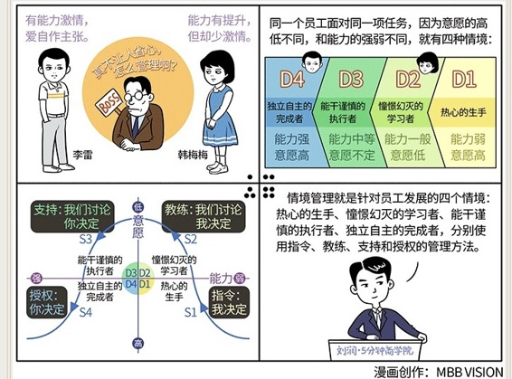

# 088｜他是钉子你用锤子，他是螺丝你用改锥

### 概念：情境管理

> 肯·布兰查德把“不同情境，不同管理”的方法论，叫做：情境管理（Situational Leadership）。他认为，同一个员工，面对同一项任务，因为意愿（Desire）的高低不同，和能力（Ability）的强弱不同，就有四种情境：

D1，热心的生手。刚接手一项新任务的员工，通常意愿高，很想干，但是能力弱。

D2，憧憬幻灭的学习者。工作了一段时间，能力有提升，但未达到胜任的程度，员工开始迷惘甚至沮丧。这时他的工作意愿降低，能力在弱到一般的水平。

D3，能干谨慎的执行者。员工继续进步，有较好的工作能力了，但信心还不稳定。这时，员工的意愿不定，能力中等到强。

D4，独立自主的完成者。员工终于完全胜任工作了，很兴奋，这时，他们的意愿最高，能力最强。

Ken说，员工的情境，通常是从D1到D4的不断发展的。情境管理，就是第一，识别员工所处的情境，第二，运用这个情境的管理方法。

### 案例：

> 韩梅梅加入公司两年了，你明显感到，她工作能力有提升，但不如刚进公司时那么有激情了。你有些焦虑，经常找她谈话，并试着让她独立负责一摊工作，用责任唤醒激情，然而 …… 她居然把事情做砸了。然后情绪更低落了。

> 而李雷呢，激情和能力兼具，什么都做得很好，但喜欢自作主张，不和你商量。你很恼火，责令他重大事项必须汇报。但什么是“重大事项”呢？你们俩达不成一致。你很不满，但你知道，如果过于苛责，他可能就离职了。

真不让人省心。所以，很多人兴高采烈地“学而优则仕”，做了段时间管理后，焦头烂额，最后向老板申请：我还是做回技术吧。管理的难处是，没有放之四海而皆准的法门。因为每个人都是不一样的，所以对每个人，甚至对每个人的不同情境，管理手段都可能不同。

### 运用：不同情境 - 不同管理方法

知道员工处于哪个情境非常重要。他是钉子，你用锤子；他是螺丝，你用改锥。Ken说，箱子里有四把管理工具：S1指令，S2教练，S3支持，S4授权，可以分别在D1、D2、D3和D4阶段使用。

#### 对于D1，热心的生手，应该用S1，指令。

管理者应肯定员工的热情，但在工作上，尽量给出明确的目标，和做好工作的标准，说明工作范围、权限和责任，期待得到什么样的反馈，并让他明确，只有你能做出决定。一句话：我决定。

#### 对于D2，憧憬幻灭的学习者，也就是韩梅梅处于的状态，应该用S2，教练。

管理者应经常给员工反馈，允许犯错，进步表扬，失败一起分析原因，鼓励员工多思考，自主地提出方案，允许参与讨论和决策流程，但依然由管理者做决策。一句话：我们讨论，我决定。

#### 对于D3，能干谨慎的执行者，应该用S3，支持。

员工已具备很强的能力了，管理者要尽量成为平易近人的良师益友，帮助其建立信心，认可其高超能力，和员工一起讨论问题，鼓励他做最终的决定，训练他对决定的结果负责。一句话：我们讨论，你决定。

#### 对于D4，独立自主的完成者，也就是李雷处于的状态，应该用S4，授权。

这个阶段，员工的能力和意愿都不是问题了，李雷已成为公司的骨干，很多问题，其实都来自于管理者自己的失落。这时，管理者要懂得给员工自主权、信赖，和由衷的感谢。在对结果负责的前提下，充分授权。一句话：你决定。

再回到开始的案例，这位管理者的问题是：用同一种方法，S3支持，管理韩梅梅的D2情境，和李雷的D4情境。Ken调查过，70%以上的领导者都只会用一种的管理方法，用过三种管理方法的人数不足1%。

### 小结：认识情境管理

情境管理，就是针对员工发展的四个情境：热心的生手、憧憬幻灭的学习者、能干谨慎的执行者、独立自主的完成者，分别使用指令、教练、支持和授权的管理方法。

大多数人，以会使用“支持”而自豪，但真正高效的管理者，会“看情况”，因人而异、因时而异，使用不同的管理方法，培养员工，达成绩效。