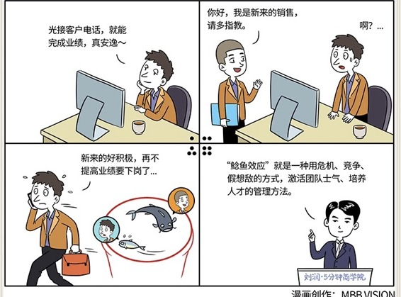

# 089｜用危机和竞争，激活团队

### 概念：鲶鱼效应

挪威人爱吃沙丁鱼，尤其是鲜活的，所以活沙丁鱼的价格，是死的好几倍。但沙丁鱼生性懒惰不爱动，船舱里又缺氧，运到码头时，会死很多。据说，有位聪明的渔民想到一个办法：往鱼槽里扔一条鲶鱼。因为鲶鱼的入侵，沙丁鱼非常紧张，快速游动，最后，居然就活着到了港口。

这种被对手激活的现象，被称作"鲶鱼效应"。

### 案例：

你的公司经营不错，品牌越来越被消费者认可，销售部光接客户电话，就能完成业绩。有次一位客户联系到你本人，说想买你们的产品，你转给销售部负责人。结果，他几天都没联系客户，客户等不及了，于是买了别人的。你意识到这是一个问题。因为品牌的价值，大家越来越安逸，服务意识也越来越差，整个团队正在不断懈怠。

### 激活团队士气、培养人才的两个方法：

第一，招些新的销售，作为鲶鱼，扔到销售部。这样，平均每个销售接到的客户电话数，就不足以完成业绩了。鲶鱼带来了竞争，大家必须去寻找新客户，或者提高服务水平，增加转化率。

第二，成立销售二部，提拔最优秀的销售经理担任负责人，形成和原来的销售部，现在的销售一部的竞争。新领导想展示自己，老领导不甘被超越，团队会被重新点燃。

外部的商业世界，变化巨大，竞争激励。一定要适度地把外部竞争，引入内部。比如在战略上，有目的地树立对手；在考核上，有秩序地制造竞争；在人员上，有节奏地吐故纳新。这就是“鲶鱼效应”，看似残酷，但却是培养员工的有效手段。

### 运用：寻找“鲶鱼”的三个方法：

第一，中途聘用。

日本著名企业家本田参访欧美企业后，感触很多，尤其是对他们的竞争文化。他决定从外部找一条“鲶鱼”，改变他的公司。

经过周密的计划，本田把对手公司年仅35岁的武太郎挖来做销售部负责人。武太郎有丰富的经验、和极大的热情。本来死气沉沉的销售部，被他充分刺激起来，活力大大增强，公司月销售额直线上升，在欧美市场的知名度也不断提高。

本田运用的，就是“中途聘用”，从外部找“鲶鱼”，“引进一个，带动一片”。

第二，内部提拔。

中途聘用虽好，但用之不慎，可能会打击内部员工升迁的希望，甚至会产生抵触，故意和“鲶鱼”对着干：你行你上啊！然后从沙丁鱼，变为“休克鱼”。

怎么办呢？

你可以寻找公司内的潜在明星并加以培养，把这些鲶鱼，提拔到关键岗位上，也能有效激活员工；你也可以让管理者之间，适度轮岗，他们过去彼此抱怨，现在坐在对方的位置上，会抱着“超越前任”的心态工作。也可以设立试验区，把不可能、不行、很难、不愿意的很多工作，放在这里试验，让试验区的员工在“我证明给你看”的心态下，努力攻克难关。

第三，红蓝两军。

红军是正规部队。蓝军，是在军事训练时的扮演假想敌的部队。蓝军的目的，是否定红军，打击红军，就像鳗鱼的天敌，狗鱼一样。

华为就有浓厚的红蓝两军的文化。任正非说：“我特别支持成立蓝军部队，想升官，先到蓝军去，不把红军打败就不要升司令。红军的司令如果没有蓝军经历，也不要再提拔了。你都不知道如何打败华为，说明你已到天花板了。”

遇到一些重大的公司战略，可以考虑使用红蓝两军的策略。红蓝两军，也有人把它叫“内部达尔文主义”，能很有效提高团队活力，培养真正的人才。

### 小结：认识鲶鱼效应

鲶鱼效应，就是一种用危机、竞争、假想敌的方式，激活团队士气、培养人才的管理方法。

怎么利用鲶鱼效应呢？三个方法：中途聘用、内部提拔、红蓝两军。用鲶鱼效应的时候，尤其是中途聘用时，要注意“度”，避免“招来女婿、气跑儿子”。