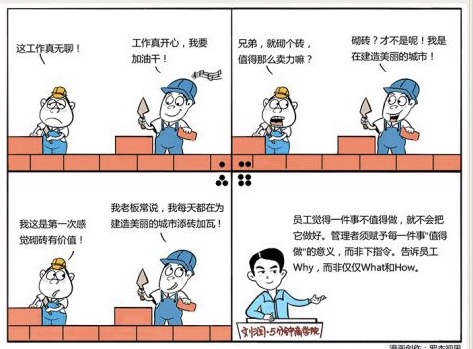

# 091｜你是想卖一辈子糖水，还是改变世界

### 概念：不值得定律

不值得定律，就是如果你觉得一件事不值得做，你就不会把它做好。不值得定律，是“用人”时最重要的定律之一，它要求管理者必须赋予每一件事值得做的意义，而不是模仿战争片说：这是命令。

### 案例

在管理例会上，你再次强调，每个销售，都要把拜访客户的记录，打了几个电话、聊了什么、他有什么爱好等等，录入到公司最新购买的CRM（客户关系管理）系统中。你已经强调100遍了，但大家都不怎么配合。

销售总监皱了皱眉头，说：这有意义吗？你强压住怒火，说：不管有没有意义，都必须坚决执行。

在军队里，下属和上级的意见不一致的时候，上级会试着说服下级。如果说服不了，上级可能会说：理解，要执行，不理解，也要执行。下级想再争辩两句，上级会说：这是命令！

这就是“军队式管理”，强调绝对服从。但是，在企业里强调“绝对服从”，可行吗？

你可以告诉销售，80%的客户，都是因为连续一周不联系而失去的。CRM会监控这个时间点，主动批一笔预算，自动根据客户爱好选择小礼品，帮助你和客户重新建立联系，提高销售业绩。

做任何一件事情，都有WHAT（做什么）、WHY（为何做）和HOW（怎么做）三个部分。最差的管理者，只告诉员工做什么；好些的管理者，会教会员工怎么做；最好的管理者，还会告诉员工为何做。

### 运用：如何从做什么，怎么做，走到“为何做”的管理境界

第一、说明“意义”。

即便是军队，都非常注重赋予战争以意义。

著名的电影《勇敢的心》里有个场景，大战即将开始，威廉·华莱士在阵前说：告诉我们的敌人，他们或许能夺走我们的生命，但永远夺不走我们的自由！

你发现，几乎每场大战前，将领都要发表演说。这个演说最重要的目的，就是赋予战争意义。

作为管理者，你可以给全体员工写邮件，谈梦想。很多创始人有意无意地谈梦想。从实用的角度说，梦想最大的作用之一，就是赋予重复、繁琐的工作以意义。我们不是在砌墙，我们是在为上帝造个家。

乔布斯当年为了让百事可乐总裁约翰·斯卡利加入苹果，说了句著名话：你是想卖一辈子糖水，还是跟着我们改变世界？

除了全员邮件之外，可以在关键项目前，召开誓师大会；结束后，召开表彰大会；过程中，前线慰问等。这些形式感，有助于赋予项目以意义。

第二、讲清“道理”。

这是对管理者基础能力的考验。这件事，和最终的业绩，或者整个公司、个人的成就之间的关系是什么？为什么必须做这件事？比如刚才说的CRM的案例。如果不理解因果逻辑，执行效果就会很差。

对于一些支持部门，比如行政、财务、人事，更要讲清楚他们的工作，和公司成功之间的关系，否则他们会觉得自己在做“没有什么价值，但总得有人做的事情”。

第三，鼓励“自发”。

不是每个人都喜欢小孩，但几乎每个人都喜欢自己的小孩。一个母亲带大自己的孩子，和带大别人的孩子，状态是完全不同的。

所以，管理者应鼓励参与决策。你可以问：你觉得这事怎么做好？和他讨论，一起优化。最后总结说：你刚才的想法，是不是这么三点，bla~bla~bla，他说：就是就是，我就是这么想的。你说：太好了，真是很棒的想法，去做吧，我支持你。

让员工觉得这是他自己的想法，自己的事，他会觉得更值得做。

#### 小结：认识不值得定律

不值得定律，就是一件事不值得做，就不会做好。

管理者如何让员工觉得一件事情值得做呢？说明“意义”，为什么要做这件事；讲清“道理”，这么做如何帮到最终的业绩；鼓励“自发”，和员工一起策划，做决策。