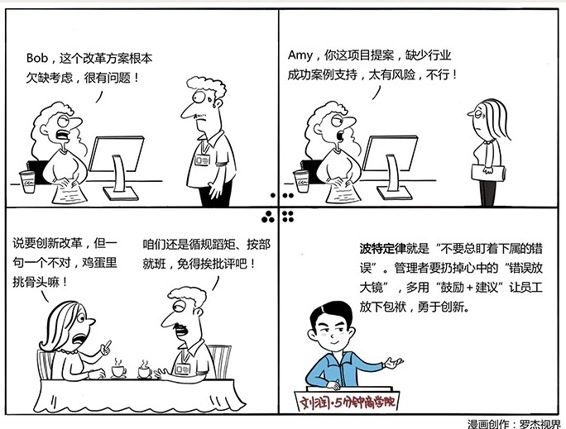

# 095｜扔掉心中的错误放大镜

### 概念：波特定律

波特定律，是指很多领导在用人时，总是盯着下属的错误。英国行为学家L·W·波特说：总盯着下属的错误，是一个领导者的最大错误。

> 通用电气的杰克·韦尔奇认为：管理者过于关注员工的错误，就不会有人勇于尝试。而没有人勇于尝试比犯错还可怕，它使员工固步自封，拘泥于现有的一切，不敢有丝毫的突破和逾越。

但是，管理者们在用人的时候，非常容易总盯着下属的错误，因为发现别人的错误，是证明自己聪明最有效的方法。

### 案例

我限定自己每年做不超过100天的演讲、培训。2015年执行得不太好，讲了126天；2016年执行得比较严格，终于控制住，讲了90几天。所以最近这些年，我很有幸被邀请去了非常多的企业，与企业家们和高管们交流。

我演讲时，有时会明显感觉，我的观点击穿了所有学员的心，气场瞬间升腾，大家很想点头，或者笑出声来。但是，但是，我发现大家都憋着，所有人的目光，望向了某一个方向。我顺着大家的目光望过去，显然，那个方向上坐的，是个领导。

这位领导面无表情，不表示赞同，也不表示反对。我也勉强算是阅人无数了，居然没有办法看出一点点情绪。这时，大家把本想释放出的情绪，又憋了回去。

每当看到这样的场景，我就知道，这样的机构，是很难有创新的。为什么？因为大家连点个头，笑一下，都要先看领导的态度，生怕犯错，那还有谁敢冒风险创新呢？

创新，从来都不是一个褒义词。创新是个中性词，因为创新有可能会成功，也有可能失败，而且大概率是会失败的。如果一个企业不允许员工犯错误，那谁还敢创新？这个机构违反了用人的一个重要定律：波特定律。

### 运用：如何扔掉错误放大镜，鼓励员工们勇于创新

#### 第一，培养允许犯错的企业文化。

我曾经有一位我非常尊敬的老板，做过高通全球副总裁，微软大中华区副总裁。他有一次给我分享他的成长经历，提到他在AT&T的时候，曾经汇报过给卡莉·菲奥莉。卡莉有着传奇的一生，担任过惠普董事会主席兼CEO，还参加过2016年美国总统大选。

我的这位老板说，他每次给卡莉汇报工作的时候，卡莉都会对他说：简直太棒了！我想，如果你能做到下面这几点，这个项目一定能获得巨大的成功。每次他离开卡莉办公室的时候，都非常激动，得到了建议，还受到了鼓励。

让每个管理者从自己做起，把批评，变成“建议+鼓励”，培养允许犯错的文化。

#### 第二，定义算术错误和高数错误。

有的同学会说，我们这个行业，就是不能犯错的啊，允许犯错，是要死人的。比如医院。

有一次我在北京做演讲，同台的有中国火箭院的党委书记。我心血来潮，就把这个问题抛给了他。我问：发射火箭，允许科学家犯错吗？

他说：允许。允许科学家犯高数的错误，但不允许犯算术的错误。高数的错误，是高级错误，是创新的风险，必须允许；但算术的错误，是低级错误，完全是因为粗心，决不允许。

企业管理也一样，要定义算术错误，和高数错误。允许犯创新带来的高级错误，不允许犯粗心带来的低级错误。

### 小结：认识波特定律

波特定律，就是“不要总盯着下属的错误”。盯着别人的错误是天性，因为发现别人的错误，是证明自己聪明最有效的方法。但作为管理者，我们在用人的时候，必须克服这个天性。

怎么做？第一，在企业里培养允许犯错的企业文化，把批评变为“建议+鼓励”；第二，定义算术错误，和高数错误。允许犯创新带来的高数错误，不允许犯粗心带来的算术错误。