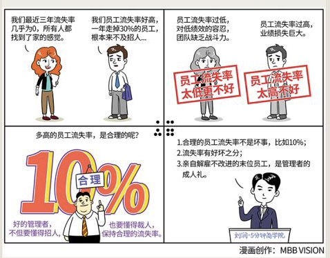

# 096｜没解雇过员工，不是好管理者

### 概念：员工流失率

员工流失率，是考验“知人善用”的管理者的一个非常重要的指标。太高、太低都不好。

> 2013年，整个美国的商业系统，平均员工流失率是15.1％。根据怡安翰威特的数据，2016年，整个中国的商业系统，平均员工流失率是20.8%。所以大家一般认为，10%是合理的员工流失率。

> 杰克·韦尔奇认为，大家很容易认识到员工流失率太高的问题，却很难认识到流失率太低的危害，所以，他提出了著名的“末位淘汰制”（也叫“活力曲线”），他把员工分为：20%的优秀员工，70%的中等员工，和10%的末位员工。末位员工必须提升自己，或者转岗，或者面临淘汰。这个制度，被认为是给通用电气带来无限活力的法宝之一。

> 当然，这个制度也从来没有少过争议。中国的法律规定，企业不能以“末位淘汰”为由，解雇员工。所以一些推行“末位淘汰制”的公司，会用PIP（Performance Improvement Program），也就是绩效改进计划，寻求在法律允许的范围内，实行“末位淘汰制”。

好的管理者，不但要懂得招人，也要懂得裁人，甚至是裁掉自己亲手招进来的人。这就像人一样，热爱美食，也要坚持运动，否则脂肪就会不断堆积，直到走不动路。

太高，显然不好。有人测算过，招聘的过程花费，大概是这名员工年薪的50％。过高的员工流失率，意味着失控的招聘成本。离职的业绩损失，大概是这名员工年薪的30%-400%。过高的员工流失率，更意味着巨大的业绩损失。

太低，其实更不好。极低的员工流失率，通常来自对低绩效的容忍。允许绩效差的员工留在团队，损失的不仅是工资，而是本应获得的业绩。另外，绩效差的员工通常更不愿离开，因为他可能找不到另一份工作。为了安全，他会想办法挤走绩效好的人，你的团队会越来越没有战斗力。

### 运用：应该怎么做呢？

第一，区分好坏。

员工流失率，只是一个笼统的指标。这10%离开的员工，有多少是优秀员工，多少是末位员工呢？优秀员工流失，叫“坏流失率”（Bad Attrition）；末位员工流失，叫“好流失率”（Good Attrition）。

我在微软时，公司就考核我部门的好流失率，和坏流失率。如果我的坏流失率不为零，也就是优秀员工在我手下流失了，那是大罪。会有人来仔细和我聊，到底出了什么问题。如果我的好流失率太低，也会有人来找我，说明我没有积极处理末位员工。

所以，你知道，做一个好的管理者有多难。

第二，避免惊讶。

很多管理者不懂得如何解雇员工，是因为绩效考核制度不健全，所以无法公平地分出20%优秀员工，70%中等员工，和10%末位员工。他们解雇“不满意”的员工，而不是“不称职”的员工。也许管理者不满意，就是因为员工不称职，但因为绩效考核制度不完善，员工很难心服口服。

另外，优秀的管理者，必须经常和员工沟通。对优秀的要支持，对中等的要帮助，对末位的要指出，让员工及时得到对自己绩效的反馈。不能全年说你好，考核说你差。要避免惊讶。

有效沟通的结果是：一名优秀员工主动离职，你不惊讶；你让一名末位员工离职，他不惊讶。

第三、果断解雇。

对持续不改进的末位员工，果断解雇。对他们的容忍，是对优秀员工的不公。

很多管理者总让HR出面，不愿亲自解雇员工。解雇员工是对管理者的一项考试，不能找人代考。亲自面对员工，第一，考验你解雇他理由，是否能让员工心服口服；第二，考验你面对员工的失望、沮丧、甚至愤怒，自己这么做是否真的合理。

没有亲手解雇过员工的管理者，不是好的管理者。

### 小结：保持“合理”的员工流失率

第一,合理的员工流失率不是坏事，比如10%，流水不腐，户枢不蠹；

第二，流失率有好坏之分，20%的优秀员工离职，是坏流失率，10%的末位员工离职，是好流失率；

第三，亲自解雇不改进的末位员工，是管理者的成人礼。