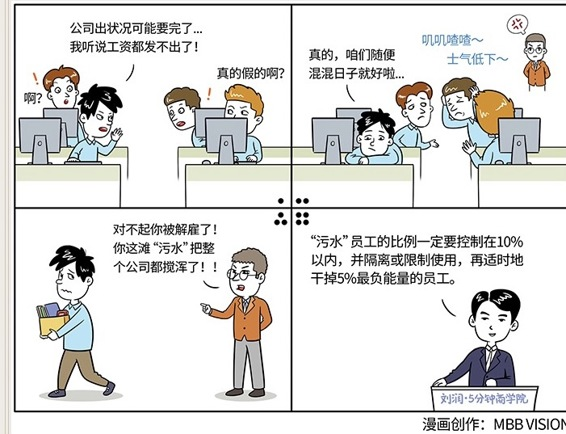

# 098｜给你的组织，装一个净水器

### 概念：酒与污水定律

管理学上有一个有趣的定律：“酒与污水定律”。

你把一勺酒倒进一桶污水，得到的是一桶污水；反过来，你把一勺污水倒进一桶酒里，得到的还是一桶污水。所以，污水和酒的比例并不能决定这桶东西的性质，真正起决定作用的就是那一勺污水，只要有它，再多的酒都成了污水。

> 听上去很高大上，但其实，中国一直有一句谚语，“一颗老鼠屎坏了一锅粥”，说明了同样的道理。

### 原因：

为什么一勺污水能污染一整桶酒，一颗老鼠屎就能坏掉一大锅粥呢？这是因为批评，比做事容易；破坏，比建设容易。作为管理者，你需要花120分精力，钻木取火，点燃大家的激情，但他用1分的精力，用一盆水就把火苗浇灭了。负能量扩散的能力，十倍、百倍于正能量。

不仅是在管理中，生活中也是一样。也许你身边就有这样负能量的朋友。他们眼里的生活永远是灰色的，和他们聊天就是听他们抱怨。他们就像黑洞一样，一点点拿走你的能量，却一点能量都不给你。每次和他聊完，你都觉得心累，怀疑人生。

所以，作为管理者，我们首先要懂得如何识别这些“污水”，然后在企业里装一个“净水器”，坚决地过滤掉这些污水。

### 运用：具体怎么做

原微软亚太研发集团主席、百度公司总裁张亚勤在一次演讲时说过，有三种“污水”是不能被用小勺，倒进公司这个大桶的，如果真倒进来了，那要尽快用“净水器”过滤。他们是：负能量的人，双面的人和玩世不恭的人。

第一，负能量的人。

这些人通常会把自己的不思进取、一事无成，解释成公司腐败、社会不公，把自己无法获得主流认可、尊重，包装成“众人皆醉我独醒”。这在心理学上可以解释。每个人都需要对自己的成功或者失败归因，把失败归因于外在，更容易获得心理的平衡。

负能量的人通常有下面这几种表现：抱怨、消极、冷淡、多疑。

抱怨，他们像“祥林嫂”一样，不停地说这个不好，那个不好。抱怨是团队中最易传播、最具杀伤力的负能量。消极，他们总是说“公司大概没前途了吧！”“这样下去怕是工资也发不出了吧！”消极，是最容易动摇军心的负能量。冷淡，他们故意不配合他人的工作，疏远同事，制造部门障碍，这将导致部门协作困难，业绩大受影响。多疑，“谁谁谁其实是谁谁的侄女”，“他今天开会时这么说，一定是想故意整我”，多疑的人总觉得他人别有用心。

第二种，双面的人。

这样的员工，对上级阿谀奉承，对下级声色俱厉。这在心理学上也可以解释，这是因为他们内心深知自己“能力配不上职位，努力配不上梦想”，所以有种深深的危机感。为了维持这种得之不易的状态，他们故意制造公司内的“信息不对称”，并从中谋利。

对这样的人，也要坚决清除，因为他们会严重造成其他依靠能力谋求发展的员工的不满，甚至失望，从而离开公司。

第三种，玩世不恭的人。

罗振宇在一期节目里说过，人有可燃型、自燃型和不可燃型三种。玩世不恭的人，就是第三种，不可燃型。怎么激发，都没有善意；怎么激励，都不会努力。

这样的员工，也应该尽量从团队里请出去，或者限制使用。他们和公司没有一致的目标，所以行为有极大的不确定性，很容易在一些关键事件上掉链子、出问题。

### 小结：认识酒与污水定律

酒与污水定律，是指，一小勺污水，可以污染一整桶酒，少量的“污水型”员工，可以传染整个公司。所以，给企业安装一个净水器，过滤负能量的人、双面的人，和玩世不恭的人。

一个企业一旦有15%的员工是“污水型”，这个企业就已经非常危险了。如果没有办法全部清除，“污水”的比例一定要控制在10%以内，并隔离或限制使用，并适时地干掉5%最负能量的员工。